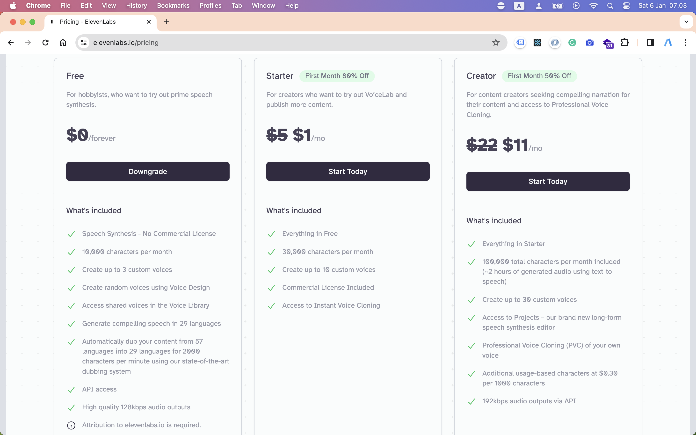

# How to get Text To Speech Audio File Automatically

When we talk about generating audio file we need do research considering the price, quality, and api support so you can generate audio programmatically.

Here i provide you with the best options:

## Eleven Labs

Eleven Labs is very cheap and perfect option for generating perfect voice for your text. They have API service also.

[https://elevenlabs.io](https://elevenlabs.io/?from=partnermurray4444)

 

## Local AI TTS

You can also use the local AI system, to do speech synthesis. You can use local PC or Google Colab.

Then synchronize (text <-> audio) it with your server.

Of course its not easy it will face many problems like:

- Is you have knowledge about python and AI ?
- How you get the models for your language ? 
When its english you can easily got the models.

When i have time i will make tutorial about how to doing local speech synthesis.