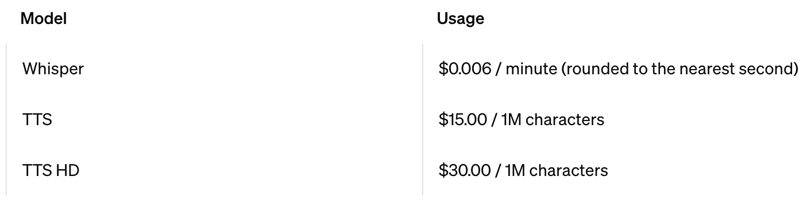

# How to get the Audio File Automatically

When we talk about generating audio files, we need to do research considering the price, quality, and API support so you can generate audio programmatically.

Table of Contents:

- [A. Efficient Cost Strategy](#a-efficient-cost-strategy)
- [B. Paid TTS API](#b-paid-tts-api)
- [C. Local AI TTS](#c-local-ai-tts)

<br>
<br>

## A. Efficient Cost Strategy

- Considering based on your needs
- When your need is multi-language, you can make a controller that uses a mix of TTS API providers.
- Using cache for the audio file


Usually I use Laravel as a backend. It's a good PHP framework, and it's easy to use. But of course, you can use any backend you want and do the same strategy.

When you implement flow like that can only generate audio file once, and when the audio file is exist, it will not generate again.

In english:

Let's say 1 blog post = 1,200 words

Words Only: 1,200 words × 5 characters per word = 6,000 characters.

Including Spaces and Punctuation: Spaces (approximately 20% of 6,000) = 6,000 × 0.2 = 1,200 characters.

Total estimated characters = 6,000 (words) + 1,200 (spaces) = 7,200 characters.

When you use open ai tts. 1 million / $15 (tts-1)

So you can generate audio of 133 post with cost $15.

But its `when all` your post is accessed. When not all post is accessed, you can save more money. even when the user is not fully reading your article.

My lib also use [batch request system](PROBLEMS.md#the-solution-is-using-batch-request-system). they only ask the backend to get/make audio for only section that user is currently reading/listening.

<br>

## B. Paid TTS API

### - ElevenLabs

[Eleven Labs](https://try.elevenlabs.io/speech-highlight) is a text-to-speech API that allows you to convert text into high-quality audio files. It supports multiple languages and voices, and provides a range of customization options to help you create the perfect audio for your needs.


<details>
  <summary>Example Client Side Code (Frontend)</summary>

```js
function convertBase64ToBlobURL(base64Audio) {
  // Remove the prefix from the data URL if present
  const base64Data = base64Audio.replace(/^data:audio\/mpeg;base64,/, "");
  // Convert base64 to raw binary data held in a string
  const byteString = atob(base64Data);
  // Create an ArrayBuffer with the binary length of the base64 string
  const arrayBuffer = new ArrayBuffer(byteString.length);
  // Create a uint8 view on the ArrayBuffer
  const uint8Array = new Uint8Array(arrayBuffer);
  for (let i = 0; i < byteString.length; i++) {
    uint8Array[i] = byteString.charCodeAt(i);
  }
  // Create a blob from the uint8Array
  const blob = new Blob([uint8Array], { type: "audio/mpeg" });
  // Generate a URL for the blob
  const blobURL = URL.createObjectURL(blob);

  return blobURL;
}

export const ttsUsingElevenLabs = async (inputText) => {
  // see https://elevenlabs.io/docs/api-reference/text-to-speech
  // https://github.com/albirrkarim/react-speech-highlight-demo/blob/main/AUDIO_FILE.md#eleven-labs

  // Set the ID of the voice to be used.
  const VOICE_ID = "21m00Tcm4TlvDq8ikWAM";

  const blobUrl = await fetch(
    process.env.NEXT_PUBLIC_ELEVEN_LABS_API_ENDPOINT,
    {
      method: "POST",
      headers: {
        "Content-Type": "application/json",
      },
      body: JSON.stringify({
        text: inputText,
        voice_id: VOICE_ID,
        model_id: "eleven_multilingual_v2",
        voice_settings: {
          stability: 0.75, // The stability for the converted speech
          similarity_boost: 0.5, // The similarity boost for the converted speech
          style: 1, // The style exaggeration for the converted speech
          speaker_boost: true, // The speaker boost for the converted speech
        },
      }),
    }
  )
    .then((response) => {
      if (!response.ok) {
        alert("Network fail");
        throw new Error(`HTTP error! Status: ${response.status}`);
      }
      return response.json();
    })
    .then((data) => {
      // Assuming the API response contains a property 'audio' with the base64-encoded audio
      const base64Audio = data.audio;

      // Create a Blob URL
      const blobUrl = convertBase64ToBlobURL(base64Audio);

      return blobUrl;
    });

  return blobUrl;
};

import { convertTextIntoClearTranscriptText } from "react-speech-highlight";

var clear_transcript = convertTextIntoClearTranscriptText(
  "This is example text you can set"
);

const audioURL = await ttsUsingElevenLabs(clear_transcript);

const { controlHL, statusHL, prepareHL, spokenHL } = useTextToSpeech({
  lang: "en",
  preferAudio: audioURL,
  //or
  //   fallbackAudio: audioURL,
});
```

</details>

<details>
  <summary>Example Integration Node js Backend with ElevenLabs TTS API</summary>

Go to the [backend folder in this repo](https://github.com/albirrkarim/react-speech-highlight-demo/tree/main/backend/nodejs), you can see the example

</details>

<details>
  <summary>Example Integration Laravel Backend with ElevenLabs TTS API</summary>

Router

```php
Route::post('text-to-speech-elevenlabs', 'textToSpeechElevenLabs')->name('text_to_speech_elevenlabs');
```

File `TTSController.php` this will return audio as base64

```php
  public function textToSpeech(Request $request)
  {
    $api_key = config('elevenlabs.api_key');
      $voice_id = isset($request['voice_id']) ? $request['voice_id'] : '21m00Tcm4TlvDq8ikWAM'; // Set the ID of the voice to be used

      $client = new Client([
          'headers' => [
              'Accept' => 'audio/mpeg',
              'Content-Type' => 'application/json',
              'xi-api-key' => $api_key,
          ],
      ]);

      try {
          $response = $client->post("https://api.elevenlabs.io/v1/text-to-speech/$voice_id", [
              'json' => $request->all(),
          ]);

          // Check if the request was successful
          if ($response->getStatusCode() === 200) {
              // Get the audio content as a base64-encoded string
              $base64Audio = base64_encode($response->getBody());

              // Return the base64-encoded audio
              return response()->json([
                  'status' => true,
                  'audio' => $base64Audio,
              ]);
          } else {
              // Handle unsuccessful response
              return response()->json([
                  'status' => false,
                  'message' => 'Text-to-speech API request failed.',
              ], $response->getStatusCode());
          }
      } catch (\Exception $e) {
          // Handle Guzzle or other exceptions
          return response()->json([
              'status' => false,
              'message' => 'Error during text-to-speech API request.',
              'error' => $e->getMessage(),
          ], 500);
      }
  }

```

</details>

### - Open AI TTS

[OpenAI](https://platform.openai.com/docs/guides/text-to-speech) is also providing tts service, for now it come with minimal feature, but its fast latency.

<a href="https://openai.com/api/pricing" target="_blank">
  
</a>

<details>
  <summary>Example OpenAI TTS Backend with Laravel</summary>

Router

```php
Route::post('text-to-speech-elevenlabs', 'textToSpeechElevenLabs')->name('text_to_speech_elevenlabs');
```

File `TTSController.php` this will return audio as base64

```php
$api_key = config('openai.api_key');

$client = new Client([
    'headers' => [
        'Authorization' => 'Bearer ' . $api_key,
        'Content-Type' => 'application/json'
    ]
]);

try {
    $response = $client->post("https://api.openai.com/v1/audio/speech", [
        'json' => [
            'model' => isset($request["model"]) ? $request["model"] : 'tts-1',
            'input' => $request["input"],
            'voice' => isset($request["voice"]) ? $request["voice"] : 'nova',
        ]
    ]);

    // Check if the request was successful
    if ($response->getStatusCode() === 200) {
        // Get the audio content as a base64-encoded string
        $base64Audio = base64_encode($response->getBody());

        // Return the base64-encoded audio
        return response()->json([
            'status' => true,
            'audio' => $base64Audio,
        ]);
    } else {
        // Handle unsuccessful response
        return response()->json([
            'status' => false,
            'message' => 'Text-to-speech API request failed.',
        ], $response->getStatusCode());
    }
} catch (\Exception $e) {
    // Handle Guzzle or other exceptions
    return response()->json([
        'status' => false,
        'message' => 'Error during text-to-speech API request.',
        'error' => $e->getMessage(),
    ], 500);
}
```

Your Client Side Code

```jsx
const ttsUsingOpenAI = async (inputText) => {
  // Set the ID of the voice to be used.

  const blobUrl = await fetch(process.env.NEXT_PUBLIC_OPENAI_TTS_API_ENDPOINT, {
    method: "POST",
    headers: {
      "Content-Type": "application/json",
    },
    body: JSON.stringify({
      input: inputText,
      model: "tts-1", //or tts-1-hd
      voice: "alloy",
    }),
  })
    .then((response) => {
      if (!response.ok) {
        throw new Error(`HTTP error! Status: ${response.status}`);
      }
      return response.json();
    })
    .then((data) => {
      // Assuming the API response contains a property 'audio' with the base64-encoded audio
      const base64Audio = data.audio;

      // Convert the base64 audio to a Blob
      const byteCharacters = atob(base64Audio);
      const byteNumbers = new Array(byteCharacters.length);
      for (let i = 0; i < byteCharacters.length; i++) {
        byteNumbers[i] = byteCharacters.charCodeAt(i);
      }
      const byteArray = new Uint8Array(byteNumbers);
      const blob = new Blob([byteArray], { type: "audio/mpeg" });

      // Create a Blob URL
      const blobUrl = URL.createObjectURL(blob);

      return blobUrl;
    });

  return blobUrl;
};

import { convertTextIntoClearTranscriptText } from "react-speech-highlight";

var clear_transcript = convertTextIntoClearTranscriptText(
  "This is example text you can set"
);

const audioURL = await ttsUsingOpenAI(clear_transcript);

const { controlHL, statusHL, prepareHL, spokenHL } = useTextToSpeech({
  lang: "en",
  preferAudio: audioURL,
  //or
  //   fallbackAudio: audioURL,
});
```

</details>

<br>

### - Google TTS API

[Google tts](https://cloud.google.com/text-to-speech) support SSML see the [pricing](https://cloud.google.com/text-to-speech/pricing)


<br>

### - Amazon Polly

See Amazon Polly [pricing](https://aws.amazon.com/polly/pricing/)

<a href="https://aws.amazon.com/polly/pricing" target="_blank">
  
</a>

For 1 million character:
Standard: $4.00
Neural: $16.00

What different between standard and neural ? [see](https://docs.aws.amazon.com/polly/latest/dg/neural-voices.html)

Simplified, Neural voices are more natural-sounding (better) than standard voices.

<br>
<br>

## C. Local AI TTS

You can also use the local AI system, to do speech synthesis. You can use local PC or Google Colab.

Then synchronize (text <-> audio) it with your server.

Of course it's not easy; it will face many problems like:

- Do you have knowledge about Python and AI?
- How do you get the models for your language?
  When it's English you can easily get the models.

When I have time I will make tutorial about how to do local speech synthesis.
