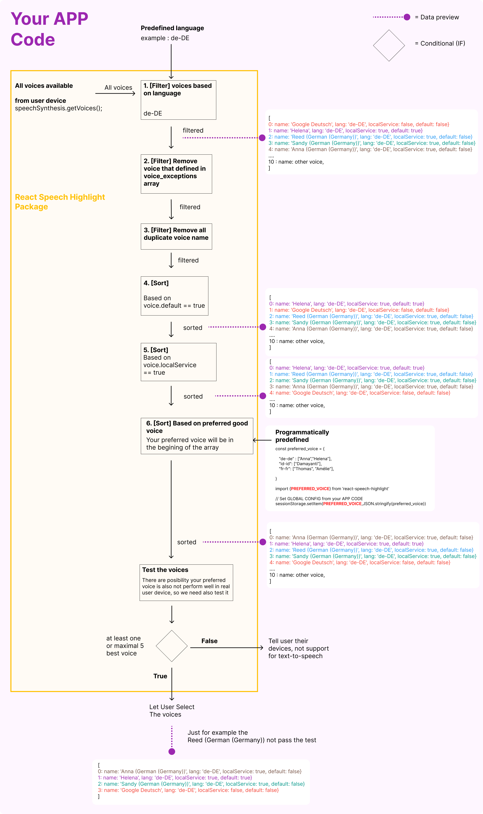

# CHANGELOG

# v4.9.1

- fix bug, double click gesture

# 4.9.0

- Add Server Side Rendering Capability, and some example on demo website because we use next js

# 4.8.9

- fix problem. The delay of audio played and user gesture to trigger play must be close. in ipad or iphone they have rule maximal delay must not more than 4 seconds or it will error.

# 4.8.8

- Batch API request for making audio file

# 4.8.7

- High precision for viseme, increase refresh rate for the viseme change with 10ms

# 4.8.6

- Increase the accuracy of word highlighting

# 4.8.5

- rename `charToVisemeMap` into `visemeMap`
- Fix bug

# 4.8.4

- Fix bug

# 4.8.3

- Use code lintings eslint for code quality

# 4.8.2

- Add viseme for current spoken.
- Introduction react state `spokenHL.viseme` as a state for current viseme. [see](https://github.com/albirrkarim/react-speech-highlight-demo/blob/main/API.md#spokenhl)
- For now only support language that use the Latin alphabet like Indonesian, English, German, Italian, and French, also the russian.

# 4.8.1

Support text to speech with highlight sentence and word for chinese and japanese character. but the accuracy of highlighting word is less accurate.

# 4.8.0

Refactor code,

# 4.7.9

- Increase avg accuracy of the sentence HL to 97.19 %

  <details>
  <summary>See test log</summary>
  ```bash
  console.log
    Text ID:  noodles  | Duration:  89.03 s  | Error Start:  7.19 s  | Error Total  15.07 s  | Error Precentage :  8.07 %

  console.log
  Text ID: preferto | Duration: 4.87 s | Error Start: 0.10 s | Error Total 0.10 s | Error Precentage : 2.05 %

  console.log
  Text ID: cat | Duration: 21.39 s | Error Start: 0.15 s | Error Total 1.11 s | Error Precentage : 0.72 %

  console.log
  Text ID: french text | Duration: 159.37 s | Error Start: 4.67 s | Error Total 9.34 s | Error Precentage : 2.93 %

  console.log
  Text ID: german text | Duration: 117.11 s | Error Start: 0.10 s | Error Total 0.75 s | Error Precentage : 0.08 %

  console.log
  Text ID: italia text | Duration: 117.63 s | Error Start: 0.48 s | Error Total 1.09 s | Error Precentage : 0.41 %

  console.log
  Text ID: html blog table | Duration: 96.68 s | Error Start: 7.94 s | Error Total 17.09 s | Error Precentage : 8.22 %

  console.log
  TEST END \_\_\_

  console.log
  Total duration error 44.56 Seconds

  console.log
  AVG LOSS 2.81 %

  console.log
  AVG ACCURACY 97.19 %

  ```
  </details>
  ```

# 4.7.8

Fix Highlight word bug

# 4.7.7

- Fix Previous and Next paragraph index
- Transcript time detection engine

  what is LOSS precentage?

  let say we have 10 seconds of audio. and fail predict start & end time of a sentence total in 2 seconds, so, the Loss precentage is 20%

  AVG LOSS 5.96 % (lower better)
  AVG ACCURACY 94 % (higher better)

  <details>

    <summary>See test log</summary>

  ```
  console.log
    id  noodles Duration:  89.03 Error:  5.14 Precentage :  5.77 %

      at log (src/__test__/test_functions/AudioFIle.test.js:44:15)

  console.log
    Error Total  11.317938041659438

      at log (src/__test__/test_functions/AudioFIle.test.js:58:15)

  console.log
    id  preferto Duration:  4.87 Error:  0.10 Precentage :  2.05 %

      at log (src/__test__/test_functions/AudioFIle.test.js:44:15)

  console.log
    Error Total  0.10199999999999979

      at log (src/__test__/test_functions/AudioFIle.test.js:58:15)

  console.log
    id  cat Duration:  21.39 Error:  0.09 Precentage :  0.42 %

      at log (src/__test__/test_functions/AudioFIle.test.js:44:15)

  console.log
    Error Total  1.0269453125000876

      at log (src/__test__/test_functions/AudioFIle.test.js:58:15)

  console.log
    id  french text Duration:  159.37 Error:  4.67 Precentage :  2.93 %

      at log (src/__test__/test_functions/AudioFIle.test.js:44:15)

  console.log
    Error Total  9.339446999995845

      at log (src/__test__/test_functions/AudioFIle.test.js:58:15)

  console.log
    id  html blog table Duration:  96.68 Error:  18.01 Precentage :  18.62 %

      at log (src/__test__/test_functions/AudioFIle.test.js:44:15)

  console.log
    Error Total  34.976419200012415

      at log (src/__test__/test_functions/AudioFIle.test.js:58:15)

  console.log
    Error Total TEST 56.76274955416778

      at Object.log (src/__test__/test_functions/AudioFIle.test.js:69:13)

  console.log
    AVG LOSS 5.96 %
  ```

  </details>

<br>

# 4.7.6

- convertInto into convertTextIntoClearTranscriptText(text,convertInto)

# 4.7.5

- We support [Vanilla Speech Highlight](https://vanilla-speech-highlight.vercel.app)

# 4.7.4

Improve accuracy make transcript timestamp.

Add new API:

- convertTextIntoClearTranscriptText(text)

Deprecation:

- setUntilTranslationForLang

# 4.7.3

- Improve Transcript timestamp detection when TTS using audio file.

# 4.7.2

- Add Highlight capability when using Prefer / Fallback To Audio File.

# 4.7.1

- Add Prefer / Fallback To Audio File

This feature enable integration with any services that provide audio url or maybe you have your own audio file url.

Integration with other Text To Speech / Speech Synthesis API. Like Eleven Labs

[see AUDIO_FILE.md](AUDIO_FILE.md)

# 4.7.0

Efficiency memory

# 4.6.9

- Introduction API `prepareHL.loadingProgress` for knowing the testing progress


- Optimize finding best voice, see the flow bellow:


<details>
<summary>Show detail voice recomendation flow</summary>



</details>

<br/>

You can set preferred voice

```jsx
import { PREFERRED_VOICE } from "react-speech-highlight";

// set global preferred voice
useEffect(() => {
  const your_defined_preferred_voice = {
    // important! Define language code (en-us) with lowercase letter
    "de-de": ["Helena", "Anna"],
  };
  sessionStorage.setItem(
    PREFERRED_VOICE,
    JSON.stringify(your_defined_preferred_voice)
  );
}, []);
```

<br/>
<br/>

# 4.6.8

- see folder `test_case` in this repo.
- 100% pass Function Unit test `markTheWords()`, `isNumber()` , `romanTransform()`.
- 90% pass prompt test.
- Fix bugs: Date range misspelled
- The `romanTransform()` is not convert all into arabic number. because it will cause ambiguity.
  The `romanTransform()` now is change string (maybe roman number exist) to a form that makes sense to pronounce.
- add `setUntilTranslationForLang("sampai","id-ID")` function to cache the english word "until" into some language. [see](API.md#7-setuntiltranslationforlang)
- The `spokenHL.sentenceSpoken` and `spokenHL.wordSpoken` is now showing the text that user see, not that exactly spoken by system.
- Better pronunciation preparing text for the system to read.
  <details>
      <summary>Show details</summary>

  <br/>
  This will only applied on background so the user seen the original text. this just for the system read correctly.

  Foreach word will apply this function
  Rules: It's document code or an Idetifier.

  `B/1871/M.SM.01.00/2023. -> B / 1871 / M. S_M. 01 .00 / 2023.`

  Rules: if the word is two uppercase character

  `RI.` -> `R_I`
  `NI` -> `N_I`

  Rules: Maybe contains date range

  `10 October - 19 November 2023` -> `10 October until 19 November 2023`
    </details>

<br/>

# 4.6.7

Unit test using jest in demo website source code folder `__test__`.

- `markTheWords()` Tests: 26 passed, 26 total

- `romanTransform()` Tests: 6 failed, 53 passed, 59 total

- `isNumber()` Tests: 3 failed, 28 passed, 31 total

<br/>

# 4.6.6

- Breaking change

  If you use this following function you need to update your code.

    <details>
    <summary>Show the different</summary>

  Different way to passing voice / selecting voice, see [the demo website repo](https://github.com/albirrkarim/demo-website-react-speech-highlight) for the implementation.

  see the component `src/Demo/ButtonSelectVoice.js` the component will save voice Info into `sessionStorage` and the package will use that voice info as the voice for playing tts.

  New:

  ```js
  controlHL.play(textEl.current, callbackDone, actionConfig);
  ```

  Old

  ```js
  controlHL.play(textEl.current, voiceURI, callbackDone, actionConfig);
  ```

    <br/>
    <br/>

  New:

  ```js
  controlHL.activateGesture(textEl.current, callback, {
    // config
    lang: lang,
  });
  ```

  Old:

  ```js
  controlHL.activateGesture(textEl.current, voiceURI, callback, {
    // config
    lang: lang,
  });
  ```

    </details>

    <br/>

- Refactor demo website with new package API
- Update marking the word function, Partially support for other character like chinese (你好), russian (Привет), japanese (こんにちは), korean (안녕하세요), etc.
- Add unit test for function, prompt engineering.
- Add `prepareHL.quicklyGetSomeBestVoice()`, `prepareHL.retestVoices()`
- Fix bug
- Add more package api, so the data and cache can be read outside package, (this package can be integrate to other package)

    <details>
      <summary>Show APIs</summary>

  ```jsx
  import {
    // Main
    markTheWords,
    useTextToSpeech,

    // Utilities for TTS & add more capabilities,
    convertAllNumberIntoWord,
    getLangForThisText,
    getTheVoices,
    noAbbreviation,
    speak,
    romanTransform,

    // Your app can read the data used by this package, like:
    PKG_STATUS_OPT, // Package status option
    PKG_DEFAULT_LANG, // Package default lang
    LANG_CACHE_KEY, // Package lang sessionStorage key
    getVoiceBasedOnVoiceURI,
    getCachedVoiceInfo,
    getCachedVoiceURI,
    setCachedVoiceInfo,
    getCachedVoiceName,
  } from "react-speech-highlight";
  ```

    </details>

<br/>

# 4.6.5


- Securing secret key with make backend server as a proxy. see [How to make backend api server for this package](MAKE_BACKEND.md)

<br/>

# 4.6

- Optional integration with openai (chatgpt api)

```jsx
convertAllNumberIntoWord();
getLangForThisText();
```

- Fix bug

<br/>

# 4.5

- Add precentage of TTS reading by word and sentence

```
spokenHL.precentageWord
spokenHL.precentageSentence
```

- Change config while TTS playing `controlHL.changeConfig()`

- Fix more bug

<br/>

# 4.4

- Convert into npm package, you can implement this package as local npm package

- Add seeking by sentence and paragraph

```jsx
controlHL.seekSentenceBackward();
controlHL.seekSentenceForward();
controlHL.seekParagraphBackward();
controlHL.seekParagraphForward();
```

- Add Gesture Based

```jsx
controlHL.activateGesture();
```

- Update demo website
- Fix more bug
- Refactor

<br/>

# 4.3

- Still buggy
