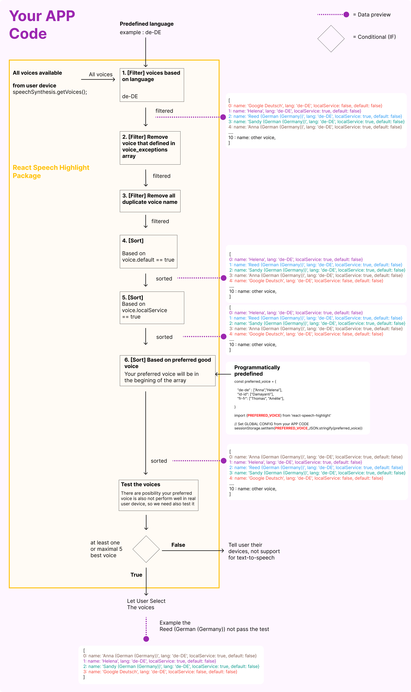

# Problems

## A. Common problem in Text to Speech (Both audio file and Web Speech Synthesis)

### 1. Pronunciation Problem

We want the text users see to be different from what the system should speak.

What do we do? We make an engine that can do accurate and cost-effective pronunciation correction using LLM OpenAI Chat Completions for any terms or equations from academic papers, math, physics, computer science, machine learning, and more...

<details>
  <summary>Show details</summary>
  <br/>

**Auto Pronunciation Correction**

This package needs chat gpt api to do that. [see how to use integrate this package with open ai api](MAKE_BACKEND.md)

  <br/>

**Manual Pronunciation Correction**

In English, abbreviations like `FOMO`, `ETA`, etc.

This package also has a built-in abbreviation function, or you can write your own rules.

```
input:string -> abbreviation function -> output:string.
```

</details>

<br/>

## B. When Using Audio File

### 1. The delay of audio played and user gesture to trigger play must be close.

When a user clicks the play button, the system will be preparing the audio file by sending a request to a TTS API like ElevenLabs. What if the API request takes too long (because the text you send is long)? What if your TTS API has limitations?

This will cause a bad experience for the user.

<details>
  <summary>Read more</summary>

This will cause a bad experience for the user. Even on devices like iPad and iPhone, they have rules that the delay between user interaction and the audio being played must not exceed 4 seconds, or it will fail.

They will give error like this

```
Unhandled Promise Rejection: NotAllowedError: The request is not allowed by the user agent or the platform in the current context, possibly because the user denied permission.
```

So what's the solution for this?

I set this package to make batch requests for API calls.</details>

### 2. Long text request to TTS API (Capability of TTS API handling long text)

All TTS APIs have limitations on the number of characters that can be sent to them.

### The solution is using Batch Request System

Batch strategy will solve those problems above. You can define the batch size in the [config](API.md#2a-config)

<br/>

<details>
  <summary>Read more</summary>

  <br/>

**How it work?**

Let's say you have 10,000 characters of text, and let's say your TTS API service will be done making the audio file in 60 seconds. (So your user will be waiting 60 seconds after they want to play? That's bad!)

So, my package will chunk it into close to 200 characters each.

10000/200 = 50 requests.

60/10000\*200 = 1.2 seconds

My package will send the first chunk, and the TTS API will give the audio file in just 1.2 seconds, then the audio is played.

So the delay between user clicking the play button and the TTS starting to play will be just 1.2 seconds. What about other chunks? I manage to send other chunks in the background while TTS is being played, and enhance efficiency of character usage in the TTS API. You pay the TTS API service based on characters, right?

lets say we have

```
chunk0 <- user still playing this
chunk1
chunk2 <- my package will try to prepare until this
chunk3
...
  chunk49
```

This method will solve other problems like the maximum character limit that your TTS API can handle. For example, on ElevenLabs, they can only do [5000](https://help.elevenlabs.io/hc/en-us/articles/13298164480913-What-s-the-maximum-amount-of-characters-and-text-I-can-generate) characters for audio generation.</details>

<br/>
<br/>

## C. When Using Web Speech Synthesis

The [SpeechSynthesis](https://developer.mozilla.org/en-US/docs/Web/API/SpeechSynthesis) comes with problems:

### 1. Unlimited String Length Capability

Some available voices don't support long text / strings.

How about this package? It can read unlimited strings (can't die when playing).

<!-- But when marking the word (more than `2400 sentences, 45700 words, 260500 character`) it getting slow when react ui render (lag). after rendered it will normal again and can play tts. -->

<br/>

### 2. Cross Platform Problem

I'm sure you have the same experience: developing web applications for cross-platform (Android, iPhone, or iPad) always results in problems.

- Speech synthesis in iOS or iPadOS sometimes dies unexpectedly.
- Sometimes `speechsynthesis` doesn't fire the `onpause`, `onresume` events on Android or iPad.

<br/>

### 3. Unpredictable Onboundary

- First, not all voices have the `onboundary` event
- On iPad, the `onboundary` event only works with about 30% of the full sentence.
- Also, the onboundary event doesn't fire functions accurately. For example, if the text is `2022`, the `onboundary` will fire twice: `20` and `22`.

<br/>

### 4. Bad performance or voice too fast

In API `prepareHL.getVoices()`, I implement this flow:

<details>
  <summary>Show flow</summary>
  <br/>



</details>

<br/>

### 5. The voice is not good enough

With `window.speechSynthesis`, the voice is like a robot and doesn't have parameters like:

- Emotions
- Characteristic

It can be achieved by using deep learning (with Python) or other paid TTS APIs.

In this package, I just wanted to make a cheap solution for TTS, so I used the `window.speechSynthesis`.

Now this package has Prefer / Fallback to Audio file.

Options to play:

preferAudio(if defined) > Web Speech Synthesis > fallbackAudio(if defined)

see [AUDIO_FILE.md](AUDIO_FILE.md) and the config [API.md](API.md#2a-config)
