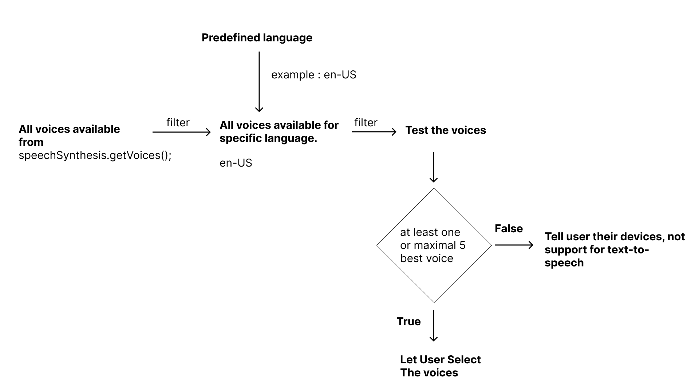

# React Speech Highlight

React components that use web speech synthesis API to text-to-speech tasks and also highlight the word and sentences that are being spoken.

# A. Introduction

Recently, i want to implement the text to speech task to my website. Then i search on the internet. but i can't find the library or npm package to solve all my problem.

The [SpeechSynthesis](https://developer.mozilla.org/en-US/docs/Web/API/SpeechSynthesis). Comes with problems:

### 1. Unlimited String Length Capability

Some available voice doesn't support long text / string.

### 2. Cross Platform Problem

I'm sure that you have the same experience, developing web for cross platform, android, Iphone or Ipad always resulting problem.

- Speech synthesis in IOS or Ipad OS sometimes die unexpected.
- Sometimes speechsynthesis doesn't fire the onpause,onresume event on android, ipad,

### 3. Unpredictable Onboundary

- First, Not all voices have `onboundary` event
- On ipad the `onboundary` event only work with about 30% of the full sentence.
- Also the on boundary event doesn't fire function accurately. for example the text is `2022` the `onboundary` will fire twice `20` and `22`.

### 4. We want Text user see is different with what system speak

Sometimes we need need abbreviation function, for example we need the text that displayed to user is different with the text that we use to give the to the [speech utterance](https://developer.mozilla.org/en-US/docs/Web/API/SpeechSynthesisUtterance/text)

**Roman Number**

We need displayed text is `I. II. III.` if we input that same text the system will read as `i. ii. iii.`

We need to change the roman numbers to arabic numbers so the system can read correctly.

**Lang Abbreviation**

in english abbreviation like `FOMO`, `ETA`, etc.

in indonesian

`dgn` = `dengan`

`yg` = `yang`

This package also have built-in abbreviation function, or you can write your own rules.

input:string -> abbreviation function -> output:string.

### 5. Bad performance or voice too fast

in API `prepareHL.getVoices()` i implement this flow.



Then I do research to build this. I took two weeks to solve the problem.

## B. TODO

- Give API for custom abbreviation function
- onboundary on ipad os sometime only works on just 30% of words in a sentence
- Give API for turn on / off highlight sentence and word
- Give API output: The html element for highlighted sentence and word. This can be benefiting when you play in web metaverse. imagine some Text-To-Speech in metaverse.
- **Let me know what you want from this package, please write it on issues tab**

## C. Version 4.0

I will update this package. to solve any known problem. so let me know the problem.

## D. Demo

[https://albirrkarim.github.io/react-speech-highlight/](https://albirrkarim.github.io/react-speech-highlight/)

## E. API

```jsx
const { controlHL, statusHL, prepareHL, spokenHL } = useTextToSpeech({
  classSentences: "highlight-sentence",
  classWord: "highlight-spoken",

  lang: "id-ID",
  pitch: 1,
  rate: 0.9,
  volume: 1,
  autoScroll: false,
  clear: true,
});
```

### controlHL

| Name               | Description | Parameter                                         |
| ------------------ | ----------- | ------------------------------------------------- |
| controlHL.play()   | Play TTS    | controlHL.play(HTML_ELEMENT,VoiceURI,callbackEnd) |
| controlHL.pause()  | Pause TTS   | Just call                                         |
| controlHL.resume() | Resume TTS  | Resume TTS                                        |
| controlHL.stop()   | Stop TTS    | Stop TTS                                          |

### statusHL

Some state that give the status of the program

The value it can be `idle|play|calibration|resume|pause|getVoicesLoading`

### prepareHL

Contain state and function to preparing the TTS. From all available voices that we can get from the SpeechSynthesis.getVoices() this package will test the voice and give 5 only best voice with language specified before

| Name                  | Description                                                    |
| --------------------- | -------------------------------------------------------------- |
| prepareHL.getVoices() | Some function to tell this program to get the best voice       |
| prepareHL.voices      | Some react state store the result from `prepareHL.getVoices()` |

### spokenHL

Contain state and function to preparing the TTS.

| Name              | Description                                  |
| ----------------- | -------------------------------------------- |
| spokenHL.sentence | Some react state, Get the sentence that read |
| spokenHL.word     | Some react state, Get the word that read     |

## E. Code

```jsx
import { useEffect, useMemo, useRef, useState } from "react";
import { markTheWords, useTextToSpeech } from "./TextToSpeech/TextToSpeech";

function Example() {
  const text = "Some Input String";
  const textEl = useRef();
  const { controlHL, statusHL, prepareHL, spokenHL } = useTextToSpeech({
    autoScroll: false,
    lang: en - US,
  });
  const textHL = useMemo(() => markTheWords(text), [text]);

  return (
    <>
      <div ref={textEl}>
        <div
          dangerouslySetInnerHTML={{
            __html: textHL,
          }}
        ></div>
      </div>

      <PanelControlTTS
        isPlay={statusHL == "play" || statusHL == "calibration"}
        play={() => {
          if (statusHL == "pause") {
            controlHL.resume();
          } else {
            controlHL.play(
              textEl.current,
              localStorage.getItem("voice_for_" + lang)
            );
          }
        }}
        pause={controlHL.pause}
        stop={controlHL.stop}
      />
    </>
  );
}
```

Sample TTS Control with material UI

```jsx
import { IconButton } from "@mui/material";
import PauseIcon from "@mui/icons-material/Pause";
import StopIcon from "@mui/icons-material/Stop";
import PlayArrowIcon from "@mui/icons-material/PlayArrow";

export default function PanelControlTTS({ isPlay, play, pause, stop }) {
  return (
    <>
      <IconButton
        onClick={() => {
          if (isPlay) {
            pause();
          } else {
            play();
          }
        }}
      >
        {isPlay ? <PauseIcon /> : <PlayArrowIcon />}
      </IconButton>

      {isPlay && (
        <IconButton onClick={stop}>
          <StopIcon />
        </IconButton>
      )}
    </>
  );
}
```
