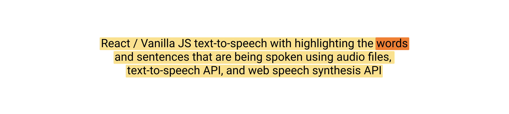
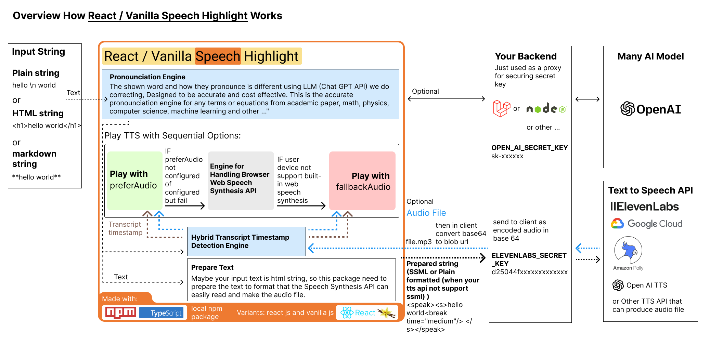
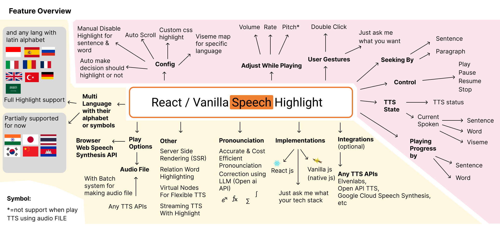

# React / Vanilla Speech Highlight

[English](README.md) | [简体中文](README_CN.md)

https://github.com/albirrkarim/react-speech-highlight-demo/assets/29292018/db35ec8b-b84b-45af-8446-9c226314b77e

React / Vanilla js text-to-speech with highlighting the words and sentences that are being spoken using audio files, text-to-speech API, and web speech synthesis API.

[Try the demo React Speech Highlight](https://react-speech-highlight.vercel.app)

## Other Version

### Vanilla JS (Native Javascript)

We support implementation using vanilla js. this package has bundle size of 86 KB. You can easily combine this library with your website, maybe your website using [jquery](https://jquery.com)

Read the [API_VANILLA.md](API_VANILLA.md) to see the different.

[Try the demo Vanilla Speech Highlight](https://vanilla-speech-highlight.vercel.app)

Do you want other implementation? just ask me via discord:
albirrkarim#8171

[Message me with discord](https://discordapp.com/channels/@me/884043164908929034)

## Features:

- Precise Highlight
- Human like sound (you can use your audio file)
- Generate viseme for current spoken TTS.
- Better pronunciation. Read roman number, document id, date range, custom abbreviation function, etc.
- Highlight animation without react rerender so the performance is fast
- Support unlimited string length
- Auto find the best voices for specific language.
- Work on all environment [see test.md](TEST.md)
- Solve the Speech Synthesis problems [see problem.md](PROBLEMS.md)

This is the Documentation for private repo [React Speech Highlight package](https://github.com/albirrkarim/react-speech-highlight) and [demo website source code](https://github.com/albirrkarim/demo-website-react-speech-highlight)

 

# Docs for v4.9.2

**Table Of Contents**

- [A. Introduction](#a-introduction)
- [B. Todo](#b-todo)
- [C. API](#c-api)
- [D. Example Code](#d-example-code)
- [E. Changelog](#e-changelog)
- [F. Disclaimer](#f-disclaimer)
- [G. Warranty](#g-warranty)
- [H. FAQ](#h-faq)

## A. Introduction

### What i want?

Recently, I want to implement the text-to-speech with highlight the word and sentence that are being spoken on my website.
Then i do search on the internet. but i can't find the npm package to solve all my problems, and also i don't want to use paid subscription to some TTS API.

I just want some powerfull package that work on all platforms and good voice quality.

### Here what i got when i search on internet:

**Using [Web SpeechSynthesis](https://developer.mozilla.org/en-US/docs/Web/API/SpeechSynthesis)**

Comes with problems (See [PROBLEMS.md](https://github.com/albirrkarim/react-speech-highlight-demo/blob/main/PROBLEMS.md)). Robot like sound, Supported Devices Available.

**Using paid subscription text-to-speech synthesis API**

When we talk about good sound / human like voices AI models inference should get involved. So it doesn't make sense if doing that on client side.

Then the speech synthesis API provider like [ElevenLabs](https://elevenlabs.io/?from=partnermurray4444), [Google Cloud](https://cloud.google.com/text-to-speech), [Amazon Polly](https://aws.amazon.com/id/polly/), and [Open AI](https://platform.openai.com/docs/guides/text-to-speech) play their roles.

But they don't provide the npm package to do highlighting.

Then i found [Speechify](https://speechify.com). but i dont find any docs about using some npm package that integrate with their service. (if some one know please tell me). Also this is a paid subscriptions services.

Searching again, Then i found [ElevenLabs](https://elevenlabs.io/?from=partnermurray4444) its free if the 10000 character / month and will reset on next month. **Cool right?** So i decide to use this as speech synthesis API in my project. But this platform also doesn't provide the react npm package to highlight their audio.

### Solutions

So, I decide to making this npm package that combines various methods above to achives all the good things and throw the bad things.

My package combines [Built in Web SpeechSynthesis](https://developer.mozilla.org/en-US/docs/Web/API/SpeechSynthesis) and Audio File (optional) to run.

When using prefer/fallback to audio file you can achive high quality sound and remove all compactbility problem from [Built in Web SpeechSynthesis](https://developer.mozilla.org/en-US/docs/Web/API/SpeechSynthesis). how you can automatically get the audio file of some text ? you can use [ElevenLabs](https://elevenlabs.io/?from=partnermurray4444), [Google Cloud](https://cloud.google.com/text-to-speech), [Amazon Polly](https://aws.amazon.com/id/polly/), and [Open AI](https://platform.openai.com/docs/guides/text-to-speech) or any other TTS API as long as they can produce audio file (mp3, mp4, wav, etc...) for the detail see the [AUDIO_FILE.md](AUDIO_FILE.md). In the [demo website](https://react-speech-highlight.vercel.app/) i provide you example using ElevenLabs and even you can try your own audio file on that demo web.

When this package just take input text and audio file, how this package know the timing spoken word or sentence of played audio? This package can detect the spoken word and sentence.

Also this package is one time pay. No Subscription. Who likes subscription? I also don't.

### Use Cases

- **Interactive Blog**

Imagine that you have long article and have TTS button then played the text to speech and users can see how far the article has been read. you article will be SEO ready because. this package has Server Side Rendering (SSR) capability.

- **Web AI Avatar / NPC**

In the [demo](https://react-speech-highlight.vercel.app/) i provide, you can see the 3D avatar from [readyplayer.me](https://readyplayer.me/) can alive playing the `idle` animation and their mouth can synchronize with the highlighted text to speech, it because this package has react state that represent [current spoken viseme](https://github.com/albirrkarim/react-speech-highlight-demo/blob/main/API.md#spokenhl). the viseme list that i use in the demo is [Oculus OVR LipSync](https://docs.readyplayer.me/ready-player-me/api-reference/avatars/morph-targets/oculus-ovr-libsync).

 
 

## B. TODO

- [ ] Add viseme support for chinese character
- [ ] Let me know what you want from this package, please write it on issues tab, or send me discord message @albirrkarim

 

- [x] Rewrite using [Typescript](https://www.typescriptlang.org/)
- [x] Server Side Rendering Capability, see our demo is using [next js](https://nextjs.org/)
- [x] Batch API request for making the audio file for long article content. it will improve efficiency and user experience. [it for solve The delay of audio played and user gesture to trigger play must be close.](https://github.com/albirrkarim/react-speech-highlight-demo/blob/main/PROBLEMS.md#1-the-delay-of-audio-played-and-user-gesture-to-trigger-play-must-be-close)
- [x] Add example text to speech with viseme lipsync on 3D avatar generated from [readyplayer.me](https://readyplayer.me). [see](https://vanilla-speech-highlight.vercel.app)
- [x] Code Linting using eslint
- [x] Add viseme API for current spoken TTS, [see](https://vanilla-speech-highlight.vercel.app)
- [x] Add vanilla js support, for those who dont use react, [see](https://vanilla-speech-highlight.vercel.app)
- [x] Add highlight capability when play using audio file.
- [x] Add fallback/prefer to audio file (.mp3/etc) when user doesn't have built in speech synthesis in their devices. or maybe prefer using audio file because the sound is better than robot like sound. [see](AUDIO_FILE.md)
- [x] Docs integration text-to-speech with [Eleven Labs](https://elevenlabs.io/?from=partnermurray4444) API [see the demo web](https://react-speech-highlight.vercel.app)

- [x] Integration with [React GPT Web Guide](https://github.com/albirrkarim/react-gpt-web-guide-docs) Package.
- [x] Automate the testing (Prompt Test, Unit Test)
- [x] Multi character support for non latin alphabet ( chinese (你好),
      russian (Привет), japanese (こんにちは), korean (안녕하세요), etc )
- [x] Convert number into word form number with chat gpt. [see](API.md#API.md#1-convertallnumberintoword)
- [x] Add language detection using chat gpt. [see](API.md#2-getlangforthistext)
- [x] Add seeking by sentence or paragraph. [see](API.md#2b-interface)
- [x] Add reading progress by word or sentence. [see](API.md#spokenhl)
- [x] Adjust config while TTS playing. [see](API.md#controlhl)
- [x] You can use custom Abbreviation Function. [see](API.md#1-tts-marker-markthewords)
- [x] Add Read Roman number, And API for that function. [see](API.md#6-romantransform)
- [x] TTS that can't die.
- [x] Test on any platform.
- [x] Add demo website. [see](https://react-speech-highlight.vercel.app)

 
 

## C. API

See [API.md](API.md)

 
 

## D. Example Code

see [EXAMPLE_CODE.md](EXAMPLE_CODE.md) it contain simple example code.

The full example code and implementation example is using source code from [demo website](https://react-speech-highlight.vercel.app). the source code of demo website is included when you buy this package.

 
 

## E. Changelog

Changelog contains information about new feature, improve accuracy, fix bug, and what you should do when the version is update.

See [CHANGELOG.md](CHANGELOG.md)

 
 

## F. Disclaimer

There's no refund

 
 

## G. Warranty

I love feedback from my customers. You can write on the issue tab so when i have time i can try to solve that and deliver for the next update.

 
 

## H. FAQ

  
Why it's expensive? Why it's not opensource package?

  
   

Try yourself to make this package. you will be grateful I am selling it cheap.

Well, i need money to funding the research, you know that making package is cost a lot of time and of course money.

 

  
Can you give me some discount?

  
   

Yes, if you are student.

 

  
How accurate the viseme generation?

   
  
  Goto the [Vanilla Speech Highlight](https://vanilla-speech-highlight.vercel.app)

I make demo for outputing the viseme into console.log. just open the browser console and play the prefer audio example (english). and you will see the word and viseme in the current timing of played tts.

 

  
How accurate the highlight capability?

   
  
  Just see the demo

 

  
Why there's no voices available on the device?

   

Try to use Prefer or Fallback to Audio File see [AUDIO_FILE.md](AUDIO_FILE.md)

or

Try to setting the speech synthesis or language in your device.

If you use smartphone (Android):

1. Make sure you install [Speech Recognition & Synthesis](https://play.google.com/store/apps/details?id=com.google.android.tts)

2. If step 1 doesn't work. Try to download google keyboard. then setting the Dictation language. wait a few minute (your device will automatically download the voice), then restart your smartphone.

 

  
Why speech doesn't work for first played voice?

   

Your device will download that voice first. then your device will have that voice locally.

Try to use Prefer or Fallback to Audio File see [AUDIO_FILE.md](AUDIO_FILE.md)

 

  
Can i use this text-to-speech without showing the highlight?

   

Yes, [see](API.md#5-speak)

 

  
Can i build without openai API?

   
    
  Yes, but you will got this [problem](PROBLEMS.md#6-wrong-read-number)

 

  
What dependency this package use?

   
      
  see the [package.json](package.json) in this repo. see the `peerDependencies` once you build this package you will need only npm package that is in that `peerDependencies`. Only react.

This package required open ai API for better doing text-to-speech task (solve the [problem](PROBLEMS.md#6-wrong-read-number)).

 

  
Support for various browsers and devices?

   

Yes, See the detail on [TEST.md](TEST.md)

or you can Try to use Prefer or Fallback to Audio File see [AUDIO_FILE.md](AUDIO_FILE.md)

 

  
How it work?

   

As in the introduction [above](#a-introduction). Here the overview how package work.

This package use [web speech synthesis](https://developer.mozilla.org/en-US/docs/Web/API/Web_Speech_API) API to doing text-to-speech task. But this free web speech synthesis is also comes with [problem](PROBLEM.md).

Then this package provide interface, that add capability, features and importantly try to fix the all problem.

When try to fix some problem this package require help from [open ai chat completion API](https://platform.openai.com/docs/api-reference/chat) that adding understanding capability. like adding function to detect language, solve [this problem](PROBLEMS.md#6-wrong-read-number).

Simpler approach is use Prefer or Fallback to Audio File see [AUDIO_FILE.md](AUDIO_FILE.md)

 

## Keywords

So this package is the answer for you who looking for:

- **Best Text to Speech Software**. For now this is the best library you can find.
- **text to speech with viseme lipsync javascript**. Our package is the easy way you can do that.
- javascript text to speech highlight words.
- How to text to speech with highlight the sentence and words like speechify
- How to text to speech with highlight the sentence and words using elevenlabs
- How to text to speech with highlight the sentence and words using open ai
- How to text to speech with highlight the sentence and words using google speech synthesis
- Text to speech react js
- Text to speech javascript
- Highlighted Text to Speech
- Speech Highlighting in TTS
- TTS with Sentence Highlight
- Word Highlight in Text-to-Speech.
- Elevenlabs TTS
- Highlighted TTS Elevenlabs
- OpenAI Text to Speech
- Highlighted Text OpenAI TTS
- React Text to Speech Highlight
- React TTS with Highlight
- React Speech Synthesis
- Highlighted TTS in React
- Google Speech Synthesis in React
- Text to Speech React JS
- React JS TTS
- React Text-to-Speech
- TTS in React JS
- React JS Speech Synthesis
- Text to Speech JavaScript
- JavaScript TTS
- Text-to-Speech in JS
- JS Speech Synthesis
- Highlighted TTS JavaScript