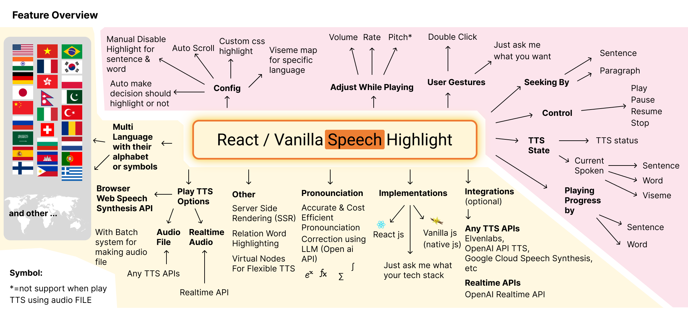

# React / Vanilla Speech Highlight

[English](README.md) | [简体中文](README_CN.md)


https://github.com/albirrkarim/react-speech-highlight-demo/assets/29292018/06e7b0a2-8c19-4ffc-826e-1470a275dfcb

React / Vanilla js text-to-speech with highlighting the words and sentences that are being spoken using audio files, text-to-speech API, and web speech synthesis API.

[Try the demo React Speech Highlight](https://react-speech-highlight.vercel.app)

## Other Version

### Vanilla JS (Native Javascript)

<a href="https://vanilla-speech-highlight.vercel.app" target="_blank">
  
</a>

We support implementation using vanilla js. this package has bundle size of 45 KB. You can easily combine this library with your website, maybe your website using [jquery](https://jquery.com)

Read the [API_VANILLA.md](API_VANILLA.md) to see the different.

[Try the demo Vanilla Speech Highlight](https://vanilla-speech-highlight.vercel.app)

Watch [Youtube Video](https://youtu.be/vDc7L5W7HhU) about implementation vanilla speech highlight for javascript text to speech task.

### React Native Speech Highlight

<a href="https://bit.ly/RNSHL-4-9-9" target="_blank">
  
</a>

https://github.com/albirrkarim/react-speech-highlight-demo/assets/29292018/abb9cb6c-4c55-448b-a9a5-d1856896b455

Built with react native cli. [Try the demo android app](https://bit.ly/RNSHL-4-9-9)

Do you want other implementation? just ask me via discord: albirrkarim

## Features:

- Precise Highlight
- Human like sound (you can use your audio file)
- Generate viseme for current spoken TTS.
- Accurate terms or equations pronunciation using LLM, [see](PROBLEMS.md#1-pronounciation-problem)
- Highlight animation without react rerender so the performance is fast
- Work on all environment
- Solve the [Text To Speech Problems](PROBLEMS.md)
- Well Crafted: Written in Typescript, Test with Jest, Code linting with Eslint, Well documented with JS Doc, and tested in production devices.

This is the Documentation for [web version](#the-web-version-react-and-vanilla-js)

<br/>

# Docs for v5.0.0

**Table Of Contents**

- [A. Introduction](#a-introduction)
- [B. Todo](#b-todo)
- [C. API & Example Code](#c-api--example-code)
- [D. Changelog](#d-changelog)
- [E. Disclaimer & Warranty](#e-disclaimer--warranty)
- [F. FAQ](#f-faq)
- [G. Payment](#g-payment)

## A. Introduction

### What i want?

Recently, I want to implement the text-to-speech with highlight the word and sentence that are being spoken on my website.

Then i do search on the internet. but i can't find the npm package to solve all TTS [problems](PROBLEMS.md)

I just want some powerfull package that flexible and good voice quality.

### Here what i got when i search on internet:

Overall the text to speech task comes with problems (See the detail on [PROBLEMS.md](PROBLEMS.md)) whether using web speech synthesis or the audio file.

**Using [Web SpeechSynthesis](https://developer.mozilla.org/en-US/docs/Web/API/SpeechSynthesis)**

They have problems Robot like sound, Supported Devices Available, etc..

**Using paid subscription text-to-speech synthesis API**

When we talk about good sound / human like voices AI models inference should get involved. So it doesn't make sense if doing that on client side.

Then the speech synthesis API provider like [ElevenLabs](https://elevenlabs.io/?from=partnermurray4444), [Google Cloud](https://cloud.google.com/text-to-speech), [Amazon Polly](https://aws.amazon.com/id/polly/), and [Open AI](https://platform.openai.com/docs/guides/text-to-speech) play their roles.

But they don't provide the npm package to do highlighting.

Then i found [Speechify](https://speechify.com). but i don't find any docs about using some npm package that integrate with their service. Also this is a paid subscriptions services. And they can't highlight chinese word [see](https://speechify.com/text-to-speech-online/chinese).

Searching again, Then i found [ElevenLabs](https://elevenlabs.io/?from=partnermurray4444) its free if the 10000 character / month and will reset on next month. **Cool right?** So i decide to use this as speech synthesis API in my project. This platform also doesn't provide the react npm package to highlight their audio, but they provide [streaming output audio](https://elevenlabs.io/docs/api-reference/websockets#streaming-output-audio) that can be use to produce "when the words is spoken in some audio" (transcript timestamp) like [someone make about this thing](https://medium.com/@brandon.demeria/synchronized-text-highlighting-with-elevenlabs-speech-in-laravel-php-e387c2797396).

**In production you must do cost calculation**, which TTS Service API provider you should choose. The services that have capability streaming audio is promising highlight word. but also comes with high price. **The cheap TTS service API usually don't have much features.**

The elevenlabs have produce good quality voice and many features, but when comes for production they more expensive compares with Open AI TTS, In production the cost is important matter.

### Solutions


So, I decide to making this npm package that combines various methods above to achives all the good things and throw the bad things. **All is done in client side**, look at the overview above. No need to use advanced backend hosting.

My package combines [Built in Web SpeechSynthesis](https://developer.mozilla.org/en-US/docs/Web/API/SpeechSynthesis) and Audio File (optional) to run.

When using prefer/fallback to audio file you can achive high quality sound and remove all compactbility problem from [Built in Web SpeechSynthesis](https://developer.mozilla.org/en-US/docs/Web/API/SpeechSynthesis). 

How you can automatically get the audio file of some text ? you can use [ElevenLabs](https://elevenlabs.io/?from=partnermurray4444), [Google Cloud](https://cloud.google.com/text-to-speech), [Amazon Polly](https://aws.amazon.com/id/polly/), and [Open AI](https://platform.openai.com/docs/guides/text-to-speech) or any other TTS API as long as they can produce audio file (mp3, mp4, wav, etc...) for the detail see the [AUDIO_FILE.md](AUDIO_FILE.md). In the [demo website](https://react-speech-highlight.vercel.app/) i provide you example using ElevenLabs and even you can try your own audio file on that demo web.

This package just take input text and audio file, so you can flexible to use any TTS API that can produce audio file, The expensive one or even cheap one when you consider the cost.

How this package know the timing spoken word or sentence of played audio? This package can detect the spoken word and sentence.

This package is one time pay. No Subscription. Who likes subscription? I also don't.



### Use Cases

- **Interactive Blog**

Imagine that you have long article and have TTS button then played the text to speech and users can see how far the article has been read. you article will be SEO ready because this package has Server Side Rendering (SSR) capability.

- **Web AI Avatar / NPC**


In the [demo](https://react-speech-highlight.vercel.app/) i provide, you can see the 3D avatar from [readyplayer.me](https://readyplayer.me/) can alive playing the `idle` animation and their mouth can synchronize with the highlighted text to speech, it because this package has react state that represent [current spoken viseme](https://github.com/albirrkarim/react-speech-highlight-demo/blob/main/API.md#spokenhl). the viseme list that i use in the demo is [Oculus OVR LipSync](https://docs.readyplayer.me/ready-player-me/api-reference/avatars/morph-targets/oculus-ovr-libsync).

<!-- - **Academic Paper Reader**


The problem when we do TTS on academic text. it contains math equations, formula, symbol that the shown term is different with their pronounciation [see](PROBLEMS.md#1-pronounciation-problem). so we make some pronounciation correction engine utilizing the Open AI API to think what should the term pronounced. -->

<br>
<br>

## B. TODO

- [ ] Add Custom virtual DOM for handling unstructured HTML content (working on it)
- [ ] Add viseme support for chinese character
- [ ] Let me know what you want from this package, the package architecture is scalable to make various feature, please write it on issues tab, or send me discord message @albirrkarim

<br/>

- [x] React Native Speech Highlight - Now we add support for mobile app version using [React Native](https://reactnative.dev/), [try the demo app](#react-native-speech-highlight)
- [x] Accurate and cost effective [pronounciation correction](PROBLEMS.md#a-common-problem-in-text-to-speech-both-audio-file-and-web-speech-synthesis) Using LLM Open AI Chat Completions for any terms or equations from academic paper, math, physics, computer science, machine learning, and more...
- [x] Server Side Rendering Capability, see our demo is using [next js](https://nextjs.org/)
- [x] Batch API request for making the audio file for long article content. it will improve efficiency and user experience. [it for solve The delay of audio played and user gesture to trigger play must be close.](PROBLEMS.md#1-the-delay-of-audio-played-and-user-gesture-to-trigger-play-must-be-close)
- [x] Add example text to speech with viseme lipsync on 3D avatar generated from [readyplayer.me](https://readyplayer.me). [see](https://vanilla-speech-highlight.vercel.app)
- [x] Add viseme API for current spoken TTS, [see](https://vanilla-speech-highlight.vercel.app)
- [x] Add vanilla js support, for those who dont use react, [see](https://vanilla-speech-highlight.vercel.app)
- [x] Add highlight capability when play using audio file.
- [x] Add fallback/prefer to audio file (.mp3/etc) when user doesn't have built in speech synthesis in their devices. or maybe prefer using audio file because the sound is better than robot like sound. [see](AUDIO_FILE.md)
- [x] Docs integration text-to-speech with [Eleven Labs](https://elevenlabs.io/?from=partnermurray4444) API [see the demo web](https://react-speech-highlight.vercel.app)
- [x] Integration with [React GPT Web Guide](https://github.com/albirrkarim/react-gpt-web-guide-docs) Package.
- [x] Multi character support for non latin alphabet ( chinese (你好),
      russian (Привет), japanese (こんにちは), korean (안녕하세요), etc )
- [x] Add language detection using chat gpt. [see](API.md#2-getlangforthistext)
- [x] Add seeking by sentence or paragraph. [see](API.md#2b-interface)
- [x] Add reading progress by word or sentence. [see](API.md#spokenhl)
- [x] Adjust config while TTS playing. [see](API.md#controlhl)
- [x] Custom Abbreviation Function. [see](API.md#1-tts-marker-markthewords)
- [x] Realiability: TTS that can't die, Test on any platform, Code Linting using eslint, Using [Typescript](https://www.typescriptlang.org/), [Tested (Prompt Test, Unit Test, Engine Test)](TEST.md)
- [x] Add demo website. [see](https://react-speech-highlight.vercel.app)

<br>
<br>

## C. API & Example Code

See [API.md](API.md) and [EXAMPLE_CODE.md](EXAMPLE_CODE.md) that contain simple example code.

The full example code and implementation example is using source code from [demo website](https://react-speech-highlight.vercel.app). the source code of demo website is included when you buy this package.

This package is written with typescript, You don't have to read all the docs in here, because this package now support [js doc](https://jsdoc.app) and [VS Code IntelliSense](https://code.visualstudio.com/docs/editor/intellisense) what is that? simply its when you hover your mouse into some variable or function [VS Code](https://code.visualstudio.com) will show some popup (simple tutorial) what is the function about, examples, params, etc...

Just use the source code from demo website, you can literally just understand the package.

https://github.com/albirrkarim/react-speech-highlight-demo/assets/29292018/05d325f9-469c-47e9-97d3-10053628e18c

<br>
<br>

## D. Changelog

Changelog contains information about new feature, improve accuracy, fix bug, and what you should do when the version is update.

See [CHANGELOG.md](CHANGELOG.md)

<br>
<br>

## E. Disclaimer & Warranty

There's no refund.

I love feedback from my customers. You can write on the issue tab so when i have time i can try to solve that and deliver for the next update.

<br>
<br>

## F. FAQ

<details>
  <summary>Why it's expensive? Why it's not opensource package?</summary>
  
  <br/>

  Well, i need money to funding the research, you know that making complex package is cost a lot of time and of course money.

  Making the [pronounciation engine](PROBLEMS.md#1-pronounciation-problem) that combines prompt engineering and efficient algorithm to saving Open AI API cost. Need to be tested and the test is repeatly that cost the API call.

  Making the transcript time detection engine is also cost in making the audio file TTS API (elevenlabs).

  Just try by yourself to make this package. you will be grateful I am selling it cheap. 
</details>

<br/>

<details>
  <summary>How about support?</summary>

  <br/>
  Tell your problems or difficulties to me, i will show you the way to solve that.
  
  I provide realtime support from me with discord. (of course when its day time on Indonesia timezone). 

  Just buy it. remove the headache. and you can focus on your project.

</details>

<br/>

<details>
  <summary>Can you give me some discount?</summary>
  
  <br/>

  Yes, if you are student or teacher, you can get discount. Just show me your student card or teacher card.

  Yes, if you help me vote this package on [product hunt](https://www.producthunt.com/products/react-vanilla-speech-highlight)

</details>

<br/>

<details>
  <summary>Is it well documented and well crafted?</summary>
  
  <br/>

  You can see the docs in this repo, and this package is written with typescript, and tested using jest to make sure the quality.

  You don't have to read all the docs in here, because this package now support [VS Code IntelliSense](https://code.visualstudio.com/docs/editor/intellisense) what is that? simply its when you hover your mouse into some variable or function [VS Code](https://code.visualstudio.com/) will show some popup (simple tutorial) what is the function about, examples, params, etc...

  Just use the source code from demo website, you can literally just understand the package.

  https://github.com/albirrkarim/react-speech-highlight-demo/assets/29292018/05d325f9-469c-47e9-97d3-10053628e18c

</details>

<br/>

<details>
  <summary>This package written in Typescript? Is it can be mixed together with jsx or native js project?</summary>
  
  <br/>

Yes it can, just ask [chat gpt](https://chat.openai.com), and explain your problems.

Example :

"My project is using webpack, code is using jsx, i want to use tsx code along side the jsx, how can i?"

</details>

<br/>

<details>
  <summary>How accurate the viseme generation?</summary>
  <br/>
  
  Goto the [Vanilla Speech Highlight](https://vanilla-speech-highlight.vercel.app)

  I make demo for outputing the viseme into console.log. just open the browser console and play the prefer audio example (english). and you will see the word and viseme in the current timing of played tts.

</details>

<br/>

<details>
  <summary>How accurate the highlight capability?</summary>
  <br/>
  
  Just see the [demo](https://react-speech-highlight.vercel.app)

</details>

<br/>

<details>
  <summary>Why there's no voices available on the device?</summary>

  <br/>

  Try to use Prefer or Fallback to Audio File see [AUDIO_FILE.md](AUDIO_FILE.md)

  or

  Try to setting the speech synthesis or language in your device.

  If you use smartphone (Android):

  1. Make sure you install [Speech Recognition & Synthesis](https://play.google.com/store/apps/details?id=com.google. android.tts)

  2. If step 1 doesn't work. Try to download google keyboard. then setting the Dictation language. wait a few minute  (your device will automatically download the voice), then restart your smartphone.

</details>

<br/>

<details>
  <summary>Why speech doesn't work for first played voice? (web speech synthesis)</summary>

  <br/>

  Your device will download that voice first. then your device will have that voice locally.

  Try to use Prefer or Fallback to Audio File see [AUDIO_FILE.md](AUDIO_FILE.md)

</details>

<br/>

<details>
  <summary>Can i use this text-to-speech without showing the highlight?</summary>

  <br/>

  Yes, [see](API.md#5-speak)

</details>

<br/>

<details>
  <summary>Can i use without openai API?</summary>

  <br/>
  
  This package optionally required open ai API for better doing text-to-speech task (solve many problem that i wrote in [PROBLEMS.md](PROBLEMS.md)).

  But if you don't want to use open ai API, it can still work. see the FAQ about ***What dependency this package use?***

</details>
<br/>

<details>
  <summary>What dependency this package use?</summary>

  <br/>

  **NPM dependencies:**

  - For React Speech Highlight: See the [package.json](package.json) in this repo. see the `peerDependencies` once you build this package you will need only npm package that is in that `peerDependencies`. Only react.

  - For [Vanilla Speech Highlight](https://vanilla-speech-highlight.vercel.app): No dependency, just use the vanilla js file. 

  **AI dependencies:**

  - This package optionally required open ai API for better doing text-to-speech task (solve many problem that i wrote in [PROBLEMS.md](PROBLEMS.md)).

  - Optionally using any TTS API that can produce audio file for better sound quality. Like [ElevenLabs](https://elevenlabs.io/?from=partnermurray4444), [Google Cloud](https://cloud.google.com/text-to-speech), [Amazon Polly](https://aws.amazon.com/id/polly/), and [Open AI](https://platform.openai.com/docs/guides/text-to-speech) or any other TTS API as long as they can produce audio file (mp3, mp4, wav, etc...) for the detail see the [AUDIO_FILE.md](AUDIO_FILE.md).

</details>

<br/>

<details>
  <summary>Support for various browsers and devices?</summary>

  <br/>

  Yes, See the detail on [TEST.md](TEST.md)

  or you can Try to use Prefer or Fallback to Audio File see [AUDIO_FILE.md](AUDIO_FILE.md)

</details>

<br/>

<details>
  <summary>How it work? Is the Package Architecture Scalable?</summary>
  <br/>

  It just work. Simple explanation is in the introduction [above](#a-introduction).

  The architecture scalable, just ask me what feature you want.

</details>

<br/>

<details>
  <summary>How about API cost of using open AI API for the pronounciation engine?</summary>
  <br/>

I try to optimize the cost while maintaining the accuracy by making new version of engine. v2, v3 etc...

For now, here the test report of the pronoun v2 engines in version `4.9.7` of this library.

```js
const v2_pronoun_engine_reports = {
  overallResults: {
    Name: "v2",
    Detail: "GPT3",
    AvgAcc: "90.50%",
    AvgScore: "92.05%",
    AvgTime: "81.62s",
    AvgCost: "869.53",
    TotalTime: "652.94 s",
    TotalCost: "Rp. 6956.27", // IDR 6956.27 is about USD $0.42 cost of open AI chat completion API
    TotalRecords: 87, // 87 sentence that contain equations or term that should be the pronounciation corrected
    CreatedAt: "29-04-2024 19:07",
  },
  testResults: {
    romanNumberPronounTestCase: {
      AvgAcc: "100.00%",
      AvgScore: "95.83%",
      AvgTime: "5.19s",
      AvgCost: "53.41",
      TotalCost: "320.44",
    },
    mathEquations: {
      AvgAcc: "100.00%",
      AvgScore: "95.62%",
      AvgTime: "5.87s",
      AvgCost: "54.80",
      TotalCost: "273.98",
    },
    demoTestCase: {
      AvgAcc: "95.00%",
      AvgScore: "95.83%",
      AvgTime: "4.71s",
      AvgCost: "32.20",
      TotalCost: "644.00",
    },
    physicalEquations: {
      AvgAcc: "100.00%",
      AvgScore: "97.29%",
      AvgTime: "6.76s",
      AvgCost: "58.16",
      TotalCost: "581.62",
    },
    computerScienceTestCase: {
      AvgAcc: "90.00%",
      AvgScore: "97.58%",
      AvgTime: "7.73s",
      AvgCost: "85.52",
      TotalCost: "855.17",
    },
    machineLeaningTestCase: {
      AvgAcc: "73.68%",
      AvgScore: "80.13%",
      AvgTime: "9.99s",
      AvgCost: "109.85",
      TotalCost: "2087.12",
    },
    biologyTestCase: {
      AvgAcc: "87.50%",
      AvgScore: "96.09%",
      AvgTime: "9.79s",
      AvgCost: "119.12",
      TotalCost: "952.95",
    },
    chemistryTestCase: {
      AvgAcc: "77.78%",
      AvgScore: "78.05%",
      AvgTime: "9.47s",
      AvgCost: "137.89",
      TotalCost: "1240.99",
    },
  },
};
```

</details>

<br/>

## G. Payment

### The Web Version (React and Vanilla js)

The current price is $94 USD

**What you got**

After you pay you will be invited inside my private repo and stay inside for 1 year to receive any updates.

- [The demo website (Next js based)](https://github.com/Web-XR-AI-lab/demo-website-react-speech-highlight)

- [The package repo (React Speech Highlight)](https://github.com/Web-XR-AI-lab/react-speech-highlight)

- [The package repo (Vanilla Speech Highlight)](https://github.com/Web-XR-AI-lab/vanilla-speech-highlight)

<br/>

### The Mobile App Version (React Native)

The web version is easier to make. but in react native the code, and the flow is different. I have to rewrite the entire library and also define the different testing approach.

The price is $150.

**What you got**

- [The Demo App source code based on React Native CLI](https://github.com/Web-XR-AI-lab/react-native-speech-highlight-cli-version) (Ready) ([Try demo android app](#react-native-speech-highlight))

<br/>

### The Web Version bundled with React GPT Web Guide

[](https://github.com/albirrkarim/react-gpt-web-guide-docs)

[React GPT Web Guide](https://github.com/albirrkarim/react-gpt-web-guide-docs) ($100) + React Speech Highlight(~~$94~~)($40) = $140

**What you got**

- [The demo website (Next js based)](https://github.com/Web-XR-AI-lab/demo-website-gpt-web-guide)
- All the private repo web version of [React Speech Highlight](#the-web-version-react-and-vanilla-js)

<br/>

### Payment method

I accept various payment method:

**Github Sponsors**

Choose One Time Tab, Select the option, and follow the next instruction from github.

<a href="https://github.com/sponsors/albirrkarim" title="Github Sponsors">
    
</a>

<br/>
<br/>

If you are in indonesia (my country) you can easily transfer through bank and e wallet (gopay, shopee pay, jenius)


<br/>

<br/>
<br/>

<div align="center">

<a href="https://www.producthunt.com/products/react-vanilla-speech-highlight/reviews?utm_source=badge-product_review&utm_medium=badge&utm_souce=badge-react&#0045;vanilla&#0045;speech&#0045;highlight" target="_blank"></a>

</div>

<br/>

## Keywords

So this package is the answer for you who looking for:

- Best Text to Speech Library
- text to speech with viseme lipsync javascript
- javascript text to speech highlight words
- How to text to speech with highlight the sentence and words like speechify
- How to text to speech with highlight the sentence and words using elevenlabs
- How to text to speech with highlight the sentence and words using open ai
- How to text to speech with highlight the sentence and words using google speech synthesis
- Text to speech javascript
- Typescript text to speech
- Highlighted Text to Speech
- Speech Highlighting in TTS
- TTS with Sentence Highlight
- Word Highlight in Text-to-Speech.
- Elevenlabs TTS
- Highlighted TTS Elevenlabs
- OpenAI Text to Speech
- Highlighted Text OpenAI TTS
- React Text to Speech Highlight
- React TTS with Highlight
- React Speech Synthesis
- Highlighted TTS in React
- Google Speech Synthesis in React
- Text to Speech React JS
- React JS TTS
- React Text-to-Speech
- TTS in React JS
- React JS Speech Synthesis
- JavaScript TTS
- Text-to-Speech in JS
- JS Speech Synthesis
- Highlighted TTS JavaScript
