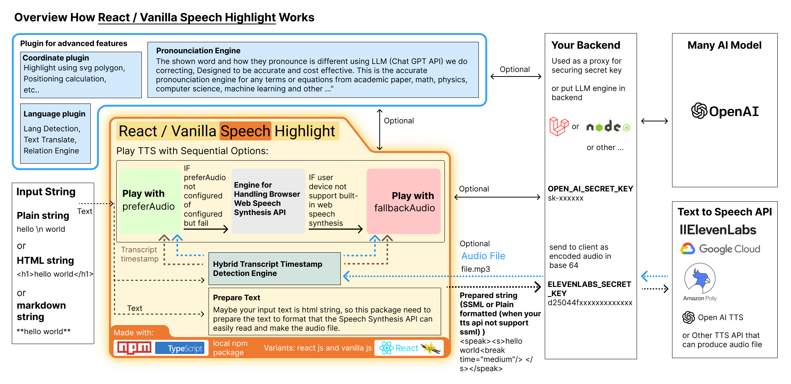
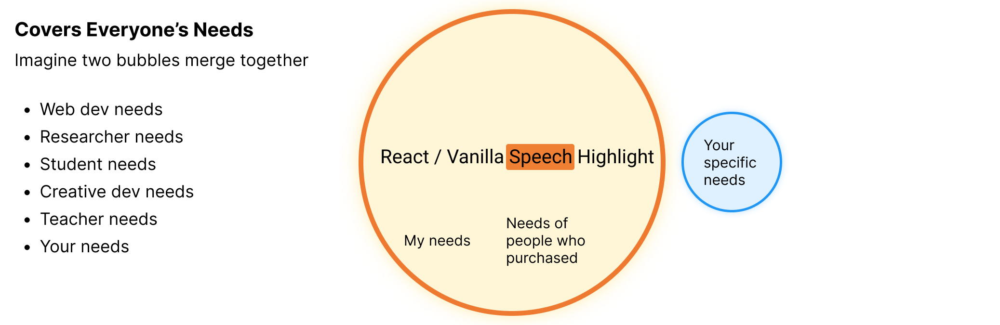

# React / Vanilla Speech Highlight - Text-to-Speech with Word Highlighting

<!-- [English](README.md) | [简体中文](README_CN.md) -->

**React / Vanilla Speech Highlight** is a powerful library for integrating **text-to-speech** and **real-time word/sentence highlighting** into your web applications. It supports **audio files**, the **Text-to-Speech API**, and the **Web Speech Synthesis API**, making it ideal for creating interactive, accessible, and dynamic user experiences.

[🌟 Try the Demo: React Speech Highlight](https://react-speech-highlight.vercel.app)

https://github.com/user-attachments/assets/79c6d4f6-f3e2-4c38-9bec-dbb6834d87f8

<!-- https://github.com/albirrkarim/react-speech-highlight-demo/assets/29292018/06e7b0a2-8c19-4ffc-826e-1470a275dfcb -->

## Other Version

### Vanilla JS (Native Javascript)

We support implementation using vanilla js. This package has a bundle size of 45 KB. You can easily combine this library with your website, maybe your website is using [jquery](https://jquery.com).

Read the [API_VANILLA.md](API_VANILLA.md) to see the difference.

[Try the demo Vanilla Speech Highlight](https://vanilla-speech-highlight.vercel.app)

Watch [Youtube Video](https://youtu.be/vDc7L5W7HhU) about implementation vanilla speech highlight for javascript text to speech task.

### React Native Speech Highlight

 

  
Show video demo

   

https://github.com/albirrkarim/react-speech-highlight-demo/assets/29292018/abb9cb6c-4c55-448b-a9a5-d1856896b455

Built with react native cli. [Try the demo android app](https://bit.ly/RNSHL-4-9-9)

Do you want other implementations? Just ask me via discord: albirrkarim

This is the Documentation for [web version](#--the-web-version-react-and-vanilla-js)

 

# Docs for v5.5.5

**Table Of Contents**

- [A. Introduction](#a-introduction)
- [B. Todo](#b-todo)
- [C. API & Example Code](#c-api--example-code)
- [D. Changelog](#d-changelog)
- [E. Disclaimer & Warranty](#e-disclaimer--warranty)
- [F. FAQ](#f-faq)
- [G. Payment](#g-payment)

## A. Introduction

### What I wanted

Recently, I wanted to implement text-to-speech with highlighting the words and sentences that are being spoken on my website.te.

Then I searched on the internet, but I couldn't find the npm package to solve all TTS [problems](PROBLEMS.md).

I just wanted a powerful package that is flexible and has good voice quality.

### Here's what I found when I searched on the internet:

Overall, the text-to-speech task comes with problems (See the details in [PROBLEMS.md](PROBLEMS.md)) whether using web speech synthesis or audio files.

**Using [Web SpeechSynthesis](https://developer.mozilla.org/en-US/docs/Web/API/SpeechSynthesis)**

They have problems like robot-like sound, limited device support, etc.

**Using paid subscription text-to-speech synthesis API**

When we talk about good sound / human-like voices, AI model inference should be involved. So it doesn't make sense to do that on the client side.

Then the speech synthesis API provider like [ElevenLabs](https://try.elevenlabs.io/speech-highlight), [Murf AI](https://get.murf.ai/0big1kdars4f), [Open AI](https://platform.openai.com/docs/guides/text-to-speech), [Amazon Polly](https://aws.amazon.com/id/polly/), and [Google Cloud](https://cloud.google.com/text-to-speech) play their roles.

But they don't provide an npm package to do highlighting.

Then I found [Speechify](https://speechify.com), but I couldn't find any docs about using an npm package that integrates with their service. Also, this is a paid subscription service.

Searching again, I found [ElevenLabs](https://try.elevenlabs.io/speech-highlight). It's free for 10,000 characters per month and will reset on the next month. **Cool right?** So I decided to use this as the speech synthesis API in my project. This platform also doesn't provide a React npm package to highlight their audio, but they provide [streaming output audio](https://elevenlabs.io/docs/api-reference/websockets#streaming-output-audio) that can be used to produce "when the words are spoken in audio" (transcript timestamp) like [someone made about this](https://medium.com/@brandon.demeria/synchronized-text-highlighting-with-elevenlabs-speech-in-laravel-php-e387c2797396).

**In production, you must do cost calculations** to decide which TTS Service API provider you should choose. The services that have streaming audio capability are promising for word highlighting, but also come with a high price. **Cheap TTS service APIs usually don't have many features.**

The [elevenlabs](<(https://try.elevenlabs.io/speech-highlight)>) produces good quality voices and many features, but when it comes to production, they are more expensive compared with Open AI TTS. In production, the cost is an important matter.

### Solutions

So, I decided to make this npm package that combines various methods above to achieve all the good things and discard the bad things. All logic is done on the client side. Look at the overview above. No need to use advanced backend hosting.

My package combines [Built in Web SpeechSynthesis](https://developer.mozilla.org/en-US/docs/Web/API/SpeechSynthesis) and Audio File (optional) to run.

When using prefer/fallback to audio file, you can achieve high-quality sound and remove all compatibility problems from [Built-in Web SpeechSynthesis](https://developer.mozilla.org/en-US/docs/Web/API/SpeechSynthesis).

How can you automatically get the audio file for some text? you can use [ElevenLabs](https://try.elevenlabs.io/speech-highlight), [Murf AI](https://get.murf.ai/0big1kdars4f), [Open AI](https://platform.openai.com/docs/guides/text-to-speech), [Amazon Polly](https://aws.amazon.com/id/polly/), and [Google Cloud](https://cloud.google.com/text-to-speech) or any other TTS API as long as they can produce audio files (mp3, mp4, wav, etc...). For details see the [AUDIO_FILE.md](AUDIO_FILE.md). In the [demo website](https://react-speech-highlight.vercel.app/), I provide you with examples using ElevenLabs, and you can even try your own audio file on that demo web.

This package just takes input text and audio files, so you can be flexible in using any TTS API that can produce audio files—the expensive ones or even cheap ones when you consider the cost.

How does this package know the timing of spoken words or sentences in played audio? This package can detect the spoken words and sentences on the client side.

This package is a one-time payment. No subscription. Who likes subscriptions? I don't either. See how to [purchase below](#g-payment).

### Use Cases

When you are an entrepreneur, I'm sure you have some crazy use cases for this package.

#### Interactive Blog

Imagine that you have a long article with a TTS button that plays the text-to-speech, and users can see how far the article has been read. Your article will be SEO-ready because this package has Server-Side Rendering (SSR) capability.

#### Web AI Avatar / NPC

In the [demo](https://react-speech-highlight.vercel.app/) I provide, you can see the 3D avatar from [readyplayer.me](https://readyplayer.me/) come alive, playing the `idle` animation, and their mouth can synchronize with the highlighted text-to-speech. This is because this package has a React state that represents the [current spoken viseme](https://github.com/albirrkarim/react-speech-highlight-demo/blob/main/API.md#spokenhl). The viseme list that I use in the demo is [Oculus OVR LipSync](https://docs.readyplayer.me/ready-player-me/api-reference/avatars/morph-targets/oculus-ovr-libsync).

#### Language Learning App With Real Human Voice

Look at example 6 on the [demo](https://react-speech-highlight.vercel.app). It's an example of using a real human voice for text-to-speech. Maybe your local language is not supported by the TTS API. You can use this package with a real human voice. The real human voice is recorded by an actual human. The real human voice is more natural than the TTS API.

#### Academic Text Reader

The problem when we do TTS on academic text is that it contains math equations, formulas, and symbols where the displayed term is different from their pronunciation [see](PROBLEMS.md#1-pronunciation-problem). So we made a pronunciation correction engine utilizing the OpenAI API to determine what the terms should be pronounced as.

#### Relation Highlight and Word Level Highlighting of Youtube Transcript

https://github.com/user-attachments/assets/799bae21-a43e-44c4-a4c7-ede7ac2d5b51

It has a YouTube iframe and the YouTube transcript on the right. When you play the YouTube video, the transcript will be highlighted. The highlighting is based on the current time of the played video. This package **follows** the time.

Relation Highlight feature - When you hover over a word, the related words will be highlighted too. For example, when you hover over a Chinese word, the pinyin and English word will be highlighted too, and vice versa. How can it do this? [See](LLM_ENGINE.md).

#### Video Player With Auto Generate Subtitle

https://github.com/user-attachments/assets/f0d8d157-1c1e-43e1-8eba-ebe7dfe3865e

Case: You just have an audio or video file without a text transcript. Our package can generate the transcript from the audio file or even translate the transcript to another language. The subtitle can be highlighted when the video is played, and it can show two different language subtitles at once, highlighting both based on the meaning of the words.

In that preview video above, the video's original language is Italian, and I also show the translation in English. The system highlights both based on the meaning.

The Italian word `bella` has the meaning `beautiful` in English.

Go to [this video demo page](https://react-speech-highlight.vercel.app/video).

#### Realtime Communication With Highlighted Text

Task where the audio is fed to the client side in real-time, like you are on a phone call—there's no audio file behind it.

Recently, OpenAI made a [realtime api](https://platform.openai.com/docs/guides/realtime). It uses [Web RTC (Web Real-Time Communication)](https://developer.mozilla.org/en-US/docs/Web/API/WebRTC_API), so you can have a phone call with AI.

Go to [realtime communication demo](https://react-speech-highlight.vercel.app/#example-realtime).

#### Your use case here

Just ask me what you want to make. The package architecture is scalable to create various features.

 
 

## B. TODO

- [ ] Automation Brute Force End to End Testing, test all APIs, runtime, sequential action, etc...
- [ ] Add viseme support for chinese character
- [ ] Let me know what you want from this package, the package architecture is scalable to make various feature, please write it on issues tab, or contact me via discord (username: albirrkarim)

 

- [x] Realtime Text to Speech With Highlight - This package can integrate with [open ai realtime api](https://platform.openai.com/docs/guides/realtime). Imagine you have a phone call with AI and the web is displaying the transcript with highlighted current spoken words.
- [x] Add example of [streaming TTS with highlight](https://react-speech-highlight.vercel.app/example). It plays TTS with highlighting while the text is still being streamed.
- [x] Re-[Architecture](#solutions) the package into a plugin system, and add optional backend-nify for the LLM Engine, so it's faster, more secure, and more reliable.
- [x] Make Hybrid engine timestamp detection
- [x] Relation Highlight Feature - Used in Youtube Transcript Highlight. Highlight the words in youtube transcript, and their relations to other word like their translation form.
- [x] Add Virtual Node for flexible highlighting
- [x] React Native Speech Highlight - Now we add support for mobile app version using [React Native](https://reactnative.dev/), [try the demo app](#react-native-speech-highlight)
- [x] Accurate and cost effective [pronunciation correction](PROBLEMS.md#a-common-problem-in-text-to-speech-both-audio-file-and-web-speech-synthesis) Using LLM Open AI Chat Completions for any terms or equations from academic paper, math, physics, computer science, machine learning, and more...
- [x] Server Side Rendering Capability, see our demo is using [next js](https://nextjs.org/)
- [x] Batch API request for making the audio file for long article content. This improves efficiency and user experience. [It solves: The delay of audio played and user gesture to trigger play must be close.](PROBLEMS.md#1-the-delay-of-audio-played-and-user-gesture-to-trigger-play-must-be-close)
- [x] Add example text to speech with viseme lipsync on 3D avatar generated from [readyplayer.me](https://readyplayer.me). [see](https://vanilla-speech-highlight.vercel.app)
- [x] Add viseme API for current spoken TTS, [see](https://vanilla-speech-highlight.vercel.app)
- [x] Add vanilla js support, for those who don't use react, [see vanilla demo](https://vanilla-speech-highlight.vercel.app)
- [x] Add fallback/prefer to audio file (.mp3/etc) when user doesn't have built in speech synthesis in their devices. or maybe prefer using audio file because the sound is better than robot like sound. [see](AUDIO_FILE.md)
- [x] Docs integration text-to-speech with [Eleven Labs](https://try.elevenlabs.io/speech-highlight) API [see the demo web](https://react-speech-highlight.vercel.app)
- [x] Integration with [React GPT Web Guide](https://github.com/albirrkarim/react-gpt-web-guide-docs) Package.
- [x] Multi character support for non latin alphabet ( chinese (你好),
      russian (Привет), japanese (こんにちは), korean (안녕하세요), etc ). [see](https://react-speech-highlight.vercel.app/#non-latin)
- [x] Add [language detection using LLM api](API.md#2-getlangforthistext)
- [x] Add [seeking by sentence or paragraph](API.md#2b-interface), [reading progress by word or sentence](API.md#spokenhl), [Adjust config while TTS playing.](API.md#controlhl), [Custom Abbreviation Function](API.md#1-tts-marker-markthewords)
- [x] Reliability: TTS that can't die, Test on any platform, Code Linting using eslint, Using [Typescript](https://www.typescriptlang.org/), [Tested (Prompt Test, Unit Test, Engine Test)](TEST.md)
- [x] Add [demo website](https://react-speech-highlight.vercel.app)

 
 

## C. API & Example Code

See [API.md](API.md) and [EXAMPLE_CODE.md](EXAMPLE_CODE.md) that contain simple example code.

The full example code and implementation example is using source code from [demo website](https://react-speech-highlight.vercel.app). the source code of demo website is included when you buy this package.

This package is written in TypeScript. You don't have to read all the docs here because this package now supports [js doc](https://jsdoc.app) and [VS Code IntelliSense](https://code.visualstudio.com/docs/editor/intellisense). What is that? Simply put, when you hover your mouse over a variable or function in [VS Code](https://code.visualstudio.com), it will show a popup (simple tutorial) explaining what the function does, examples, params, etc.

Just use the source code from demo website, you can literally just understand the package.

https://github.com/albirrkarim/react-speech-highlight-demo/assets/29292018/05d325f9-469c-47e9-97d3-10053628e18c

 
 

## D. Changelog

Changelog contains information about new feature, improve accuracy, fix bug, and what you should do when the version is update.

See [CHANGELOG.md](CHANGELOG.md)

 
 

## E. Disclaimer & Warranty

There's no refund.

I love feedback from my customers. You can write on the issue tab, so when I have time, I can try to solve that and deliver it in the next update.

Still worry? see the [reviews on producthunt](https://www.producthunt.com/products/react-vanilla-speech-highlight/reviews)

 
 

## F. FAQ

  
Why it's expensive? Why it's not opensource package?

  
   

Well, I need money to fund the research. You know that making a complex package costs a lot of time and of course money, and requires high engineering skills.

Making marking the sentence and word for all languages with different writing systems is really hard. I have done research about those languages, then made a lot of test cases to make the marking solid and reliable for all languages.

Making the [LLM engines](LLM_ENGINE.md) that combines prompt engineering and efficient algorithm to saving Open AI API cost. Need to be tested and the test is repeatly that cost the API call.

Also, I provide support via live private chat to me through discord (username: albirrkarim).

**When you try to make this package by yourself, you will need to spend a lot of time and money to make something like this package.**

This package is a `base` package that can be used for various [use cases](#use-cases). I made a lot of money with package. The limit is your entrepreneurship skill.

 

  
How about support?

  
   

Tell your problems or difficulties to me, I will show you the way to solve that.

I provide realtime support from me with discord.

Also now you can use Vibe coding tool like cursor or github copilot to explain the code base and how to use it.

Just buy it. remove the headache. and you can focus on your project.

 

  
Can you give me some discount?

  
   

Yes, if you are student or teacher, you can get discount. Just show me your student card or teacher card.

Yes, if you help me vote this package on [product hunt](https://www.producthunt.com/products/react-vanilla-speech-highlight)

 

  
Is it well documented and well crafted?

  
   

You can see the docs in this repo, and this package is written with typescript, and tested using jest to make sure the quality.

You don't have to read all the docs in here, because this package now support [VS Code IntelliSense](https://code.visualstudio.com/docs/editor/intellisense) what is that? simply its when you hover your mouse into some variable or function [VS Code](https://code.visualstudio.com/) will show some popup (simple tutorial) what is the function about, examples, params, etc...

Just use the source code from demo website, you can literally just understand the package.

https://github.com/albirrkarim/react-speech-highlight-demo/assets/29292018/05d325f9-469c-47e9-97d3-10053628e18c

 

  
This package written in Typescript? Is it can be mixed together with jsx or native js project?

  
   

Yes it can, just ask [chat gpt](https://chatgpt.com), and explain your problems.

Example :

"My project is using webpack, code is using jsx, I want to use tsx code along side the jsx, how can I?"

 

  
How accurate the viseme generation?

   
  
  Goto the [Vanilla Speech Highlight](https://vanilla-speech-highlight.vercel.app)

I made a demo for outputting the viseme into console.log. Just open the browser console and play the preferred audio example (english), and you will see the word and viseme in the current timing of played TTS.

 

  
How accurate the highlight capability?

   
  
  Just see the [demo](https://react-speech-highlight.vercel.app)

 

  
Why there's no voices available on the device?

   

Try to use Prefer or Fallback to Audio File see [AUDIO_FILE.md](AUDIO_FILE.md)

or

Try to setting the speech synthesis or language in your device.

If you use smartphone (Android):

1. Make sure you install [Speech Recognition & Synthesis](https://play.google.com/store/apps/details?id=com.google.android.tts)

2. If step 1 doesn't work. Try to download google keyboard. then setting the Dictation language. wait a few minute (your device will automatically download the voice), then restart your smartphone.

 

  
Why speech doesn't work for first played voice? (web speech synthesis)

   

Your device will download that voice first. then your device will have that voice locally.

Try to use Prefer or Fallback to Audio File see [AUDIO_FILE.md](AUDIO_FILE.md)

 

  
Can i use this text-to-speech without showing the highlight?

   

Yes, [see](API.md)

 

  
Can i use without openai API?

   
  
  This package optionally required open ai API for better doing text-to-speech task (solve many problem that i wrote in [PROBLEMS.md](PROBLEMS.md)).

But if you don't want to use open ai API, it can still work. see the FAQ about **_What dependency this package use?_**

 

  
What dependency this package use?

   

**NPM dependencies:**

- For React Speech Highlight: See the [package.json](package.json) in this repo. see the `peerDependencies` once you build this package you will need only npm package that is in that `peerDependencies`. Only react.

- For [Vanilla Speech Highlight](https://vanilla-speech-highlight.vercel.app): No dependency, just use the vanilla js file.

**AI dependencies:**

- This package optionally required open ai API for better doing text-to-speech task (solve many problem that i wrote in [PROBLEMS.md](PROBLEMS.md)).

- Optionally using any TTS API that can produce audio file for better sound quality. Like [ElevenLabs](https://try.elevenlabs.io/speech-highlight), [Murf AI](https://get.murf.ai/0big1kdars4f), [Open AI](https://platform.openai.com/docs/guides/text-to-speech), [Amazon Polly](https://aws.amazon.com/id/polly/), and [Google Cloud](https://cloud.google.com/text-to-speech) or any other TTS API as long as they can produce audio file (mp3, mp4, wav, etc...) for the detail see the [AUDIO_FILE.md](AUDIO_FILE.md).

 

  
Support for various browsers and devices?

   

Yes, See the detail on [TEST.md](TEST.md)

or you can Try to use Prefer or Fallback to Audio File see [AUDIO_FILE.md](AUDIO_FILE.md)

 

  
How it work? Is the Package Architecture Scalable?

   

It just work. Simple explanation is in the introduction [above](#a-introduction).

The architecture scalable, just ask me what feature you want.

 

  
How about API cost of using open AI API for your package use?

   

See [LLM_ENGINE.md](LLM_ENGINE.md)

 

  
Our Company have already make a lot of audio file, can i just use it for highlighting with your package?

   

No, Because my package handle all the [batching system](PROBLEMS.md#2-long-text-request-to-tts-api-capability-of-tts-api-handling-long-text), [pronunciation system](PROBLEMS.md#1-pronunciation-problem), and [providing text](API.md#3-converttextintocleartranscripttext) so the TTS API can produce the audio file that can be used for highlighting.

You can just do [caching strategy](AUDIO_FILE.md#a-efficient-cost-strategy) to cache the request response. for both open ai API and TTS API for audio file.

 

## G. Payment

### - The Web Version (React and Vanilla js)

For individual developer, freelancer, or small business.

The price is $500

You can go to [github sponsors](https://github.com/sponsors/albirrkarim) > One time tab > Fill custom amount with $500

<!-- Due to the high demand for this library, access is granted through a bidding process.

Submit your bid within the designated timeframe (every month we choose the winner).

Highest bidders get priority access.

[Fill bid form](https://forms.gle/T7ob1k7w1oywCYHP9)
 -->

After payment, you’ll be invited to my private repository, where you’ll have access for one year, including all updates during that time.

For continued access in subsequent years, you can pay USD $50 annually to remain in the private repository.

**What you got**

- [The demo website (Next js based)](https://github.com/Web-XR-AI-lab/demo-website-react-speech-highlight)

- [The package repo (React Speech Highlight)](https://github.com/Web-XR-AI-lab/react-speech-highlight)

- [The package repo (Vanilla Speech Highlight)](https://github.com/Web-XR-AI-lab/vanilla-speech-highlight)

 

<!--

### - Screencast Tutorial

I know this package is complex, some features requiring architecture & advanced programming skill to use it.

So I made some full screencast tutorial about how to use this kind of advanced weapon.

From the installation to examples of advanced implementation and more.

The price is subscription $5 / month. (Coming soon)

 

<!-- ### - The Enterprise Web Version

For you that already have business and want solid package that can be used for long term.

The price is USD $700.

**What you got**

- [Web version](#--the-web-version-react-and-vanilla-js) this package.
- Architecture support, I can make some drawing about the architecture of implementation.
- Implementation code review, I can review your code to implement best practices.
- 4 years inside private repo and support.

 

### - The Mobile App Version (React Native)

The price is USD $150.

**What you got**

- [The Demo App source code based on React Native CLI](https://github.com/Web-XR-AI-lab/react-native-speech-highlight-cli-version) (Ready) ([Try demo android app](#react-native-speech-highlight))

 

-->

### Backend Server for Advanced Features

- [Python server ($20)](https://github.com/Web-XR-AI-lab/rshl_python_helper)

Contains: YouTube relation transcript highlight, Video auto-generate transcript

- [Node js server ($20)](https://github.com/Web-XR-AI-lab/rshl_node)

Contains: Backenify LLM engines

 

<!-- ### - PDF Reader Plugin

PDF plugin is used for highlighting the text in the PDF file.

They can read many PDF structure, and determine the sequential reading from left to right. mimic user reading.

They can also read the image (highlight the image with some box) in the PDF file and determine the text in the image using LLM.

Price is $3000

**What you got**

- Demo website that include the plugin and the example use. (Coming soon)

 -->

 

<!-- ### - The Web Version bundled with React GPT Web Guide

[React GPT Web Guide](https://github.com/albirrkarim/react-gpt-web-guide-docs) ($100) + React Speech Highlight(~~$200~~)($50) = $150

**What you got**

- [The demo website (Next js based)](https://github.com/Web-XR-AI-lab/demo-website-gpt-web-guide)
- All the private repo web version of [React Speech Highlight](#the-web-version-react-and-vanilla-js)

  -->

 

### Payment method

**Github Sponsors**

Choose One Time Tab, Select the option, and follow the next instruction from github.

 
 

## Keywords

So this package is the answer for you who looking for:

- Best Text to Speech Library
- Text to speech with viseme lipsync javascript
- Javascript text to speech highlight words
- How to text to speech with highlight the sentence and words like speechify
- How to text to speech with highlight the sentence and words using elevenlabs
- How to text to speech with highlight the sentence and words using open ai
- How to text to speech with highlight the sentence and words using google speech synthesis
- Text to speech javascript
- Typescript text to speech
- Highlighted Text to Speech
- Speech Highlighting in TTS
- TTS with Sentence Highlight
- Word Highlight in Text-to-Speech.
- Elevenlabs TTS
- Highlighted TTS Elevenlabs
- OpenAI Text to Speech
- Highlighted Text OpenAI TTS
- React Text to Speech Highlight
- React TTS with Highlight
- React Speech Synthesis
- Highlighted TTS in React
- Google Speech Synthesis in React
- Text to Speech React JS
- React JS TTS
- React Text-to-Speech
- TTS in React JS
- React JS Speech Synthesis
- JavaScript TTS
- Text-to-Speech in JS
- JS Speech Synthesis
- Highlighted TTS JavaScript
- Youtube Transcript Highlight
- Word Highlight in Youtube Transcript
- How to Highlight Words in Youtube Transcript
- Youtube Transcript Word Timing
- Realtime tts with highlight
- Realtime tts streamed audio & text
