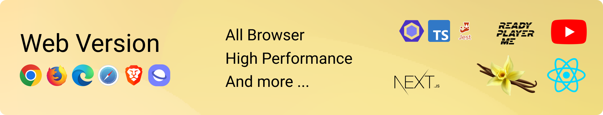

# React / Vanilla 语音高亮

[English](README.md) | [简体中文](README_CN.md)

# React / Vanilla Speech Highlight

[English](README.md) | [简体中文](README_CN.md)

https://github.com/albirrkarim/react-speech-highlight-demo/assets/29292018/06e7b0a2-8c19-4ffc-826e-1470a275dfcb

React / Vanilla JS 文字转语音，使用音频文件、文字转语音 API 和 Web 语音合成 API，对正在播放的单词和句子进行高亮显示。

[试用 React Speech Highlight 演示](https://react-speech-highlight.vercel.app)

## 其他版本

### Vanilla JS (原生 JavaScript)

我们支持使用原生 JavaScript 的实现。这个包的大小为 45 KB。您可以轻松地将此库与您的网站结合，或者您的网站可能正在使用 [jQuery](https://jquery.com)。

阅读 [API_VANILLA.md](API_VANILLA.md) 以了解不同之处。

[试用 Vanilla Speech Highlight 演示](https://vanilla-speech-highlight.vercel.app)

观看关于使用 JavaScript 进行文字转语音任务的 Vanilla Speech Highlight 实现的 [YouTube 视频](https://youtu.be/vDc7L5W7HhU)。

### React Native Speech Highlight

https://github.com/albirrkarim/react-speech-highlight-demo/assets/29292018/abb9cb6c-4c55-448b-a9a5-d1856896b455

使用 React Native CLI 构建。[试用 Android 应用演示](https://bit.ly/RNSHL-4-9-9)

想要其他实现？请通过 Discord 联系我：albirrkarim

## 功能特性：

- 精确高亮
- 类似人声（您可以使用自己的音频文件）
- 为当前语音合成生成发音嘴形
- 使用 LLM 准确发音术语或公式，[参见](PROBLEMS.md#1-pronounciation-problem)
- 无需 React 重新渲染的高亮动画，因此性能更快
- 适用于所有环境
- 解决[文字转语音问题](PROBLEMS.md)
- 精心制作：使用 TypeScript 编写，Jest 进行测试，Eslint 代码校验，JS Doc 详细文档，并在生产设备上测试

这是[网页版本](#--the-web-version-react-and-vanilla-js)的文档

 

# v5.2.9 文档

**目录**

- [A. 介绍](#a-introduction)
- [B. 待办事项](#b-todo)
- [C. API 和示例代码](#c-api--example-code)
- [D. 更新日志](#d-changelog)
- [E. 免责声明和保修](#e-disclaimer--warranty)
- [F. 常见问题](#f-faq)
- [G. 付款](#g-payment)

## A. 介绍

### 我想要什么？

最近，我想在我的网站上实现文字转语音，并高亮显示正在播放的单词和句子。

然后我在互联网上搜索，但找不到能够解决所有 TTS [问题](PROBLEMS.md)的 npm 包。

我只想要一个功能强大、灵活且语音质量好的包。

### 这是我在网上搜索时得到的结果：

总体来说，文字转语音任务存在一些问题（详见 [PROBLEMS.md](PROBLEMS.md)），无论是使用 Web 语音合成还是音频文件。

**使用 [Web SpeechSynthesis](https://developer.mozilla.org/en-US/docs/Web/API/SpeechSynthesis)**

它们存在诸如机器人声音、支持设备有限等问题。

**使用付费订阅文字转语音合成 API**

当我们谈到良好的声音/类人声音时，AI 模型推理应该参与进来。因此，在客户端进行这种操作是没有意义的。

于是，语音合成 API 提供商如 [ElevenLabs](https://try.elevenlabs.io/29se7bx2zgw1)、[Google Cloud](https://cloud.google.com/text-to-speech)、[Amazon Polly](https://aws.amazon.com/id/polly/) 和 [Open AI](https://platform.openai.com/docs/guides/text-to-speech) 发挥了他们的作用。

但他们没有提供用于高亮显示的 npm 包。

然后我找到了 [Speechify](https://speechify.com)，但没有找到任何有关使用他们服务的 npm 包的文档。此外，这是一个付费订阅服务，并且他们无法高亮显示中文单词[参见](https://speechify.com/text-to-speech-online/chinese)。

继续搜索后，我发现了 [ElevenLabs](https://try.elevenlabs.io/29se7bx2zgw1)，它在每月 10000 个字符的额度内是免费的，并且会在下个月重置。**很酷吧？** 所以我决定在我的项目中使用这个作为语音合成 API。该平台也没有提供用于高亮显示其音频的 React npm 包，但他们提供了可以用于生成“音频中单词发音时刻”（转录时间戳）的[流输出音频](https://elevenlabs.io/docs/api-reference/websockets#streaming-output-audio)，就像[有人做的那样](https://medium.com/@brandon.demeria/synchronized-text-highlighting-with-elevenlabs-speech-in-laravel-php-e387c2797396)。

**在生产环境中，您必须进行成本计算**，选择哪个 TTS 服务 API 提供商。具有流音频功能的服务在高亮显示单词方面有很大的潜力，但也伴随着高昂的价格。**廉价的 TTS 服务 API 通常没有太多功能。**

ElevenLabs 提供了高质量的语音和许多功能，但在生产环境中，其成本较高，与 Open AI TTS 相比，在生产环境中成本是一个重要的考虑因素。

### 解决方案

因此，我决定制作这个 npm 包，结合上述各种方法来实现所有优点，并去除所有缺点。**所有操作均在客户端完成**，请参阅上面的概述图。不需要使用高级后端托管。

我的包结合了 [内置的 Web SpeechSynthesis](https://developer.mozilla.org/en-US/docs/Web/API/SpeechSynthesis) 和音频文件（可选）来运行。

当优先使用/回退到音频文件时，您可以获得高质量的声音，并消除所有来自 [内置的 Web SpeechSynthesis](https://developer.mozilla.org/en-US/docs/Web/API/SpeechSynthesis) 的兼容性问题。

如何自动获取某些文本的音频文件？您可以使用 [ElevenLabs](https://try.elevenlabs.io/29se7bx2zgw1)、[Google Cloud](https://cloud.google.com/text-to-speech)、[Amazon Polly](https://aws.amazon.com/id/polly/) 和 [Open AI](https://platform.openai.com/docs/guides/text-to-speech) 或任何其他 TTS API，只要它们可以生成音频文件（mp3、mp4、wav 等）。详情见 [AUDIO_FILE.md](AUDIO_FILE.md)。在 [演示网站](https://react-speech-highlight.vercel.app/) 中，我提供了使用 ElevenLabs 的示例，您甚至可以在该演示网站上试用自己的音频文件。

这个包仅接收输入文本和音频文件，因此您可以灵活地使用任何可以生成音频文件的 TTS API，无论是昂贵的还是便宜的，取决于您的成本考虑。

这个包如何知道播放音频时所说的单词或句子的时间？这个包可以检测所说的单词和句子。

这个包是一次性支付。无需订阅。谁喜欢订阅？我也不喜欢。

### 用例

- **互动博客**

想象一下，您有一篇长文章，并有一个 TTS 按钮，可以播放文字转语音，用户可以看到文章已经读到哪里。您的文章将具备 SEO 准备，因为这个包具有服务器端渲染（SSR）能力。

- **网页 AI 头像 / NPC**

在我提供的[演示](https://react-speech-highlight.vercel.app/)中，您可以看到来自 [readyplayer.me](https://readyplayer.me/) 的 3D 头像可以播放`闲置`动画，并且他们的嘴巴可以与高亮显示的文字转语音同步，因为这个包具有代表[当前发音嘴形](https://github.com/albirrkarim/react-speech-highlight-demo/blob/main/API.md#spokenhl)的 react 状态。我在演示中使用的嘴形列表是 [Oculus OVR LipSync](https://docs.readyplayer.me/ready-player-me/api-reference/avatars/morph-targets/oculus-ovr-libsync)。

- **使用真人语音的语言学习应用**

查看[演示](https://react-speech-highlight.vercel.app)中的示例 6，这是一个使用真人语音进行文字转语音的示例。也许您的本地语言不受 TTS API 的支持，您可以使用这个包来使用真人语音。真人语音是由真人录制的，比 TTS API 更自然。

- **学术文本阅读器**

我们在学术文本中进行 TTS 时的问题是它包含数学方程式、公式、符号，其显示的术语与其发音不同 [参见](PROBLEMS.md#1-pronounciation-problem)。因此，我们利用 Open AI API 制作了一些发音校正引擎来思考术语应如何发音。

- **YouTube 字幕高亮显示的关系高亮和单词级高亮**

查看[示例 7](https://react-speech-highlight.vercel.app)，它有一个 YouTube iframe 和右侧的 YouTube 字幕，当您播放 YouTube 视频时，字幕将被高亮显示。高亮显示基于播放视频的当前时间。这个包是**跟随**时间的。

关系高亮功能 - 当您将鼠标悬停在某个单词上时，相关的单词也会被高亮显示。例如，当您将鼠标悬停在中文单词上时，拼音和英文单词也会被高亮显示，反之亦然。它是如何实现的？[参见](LLM_ENGINE.md#3-relation-finder)。限制：它只能在视频没有背景声音时使用（目前）。

 
 

## B. 待办事项

- [ ] 添加对中文字符的发音嘴形支持
- [ ] 请告诉我您希望从此包中获得什么，包的架构是可扩展的，可以实现各种功能，请在 issues 标签上写下来，或者通过 Discord @albirrkarim 发送消息给我

 

- [x] 关系高亮功能 - 用于 YouTube 字幕高亮。高亮 YouTube 字幕中的单词及其与其他单词的关系，例如其翻译形式。
- [x] 添加自定义虚拟 DOM 以处理非结构化 HTML 内容
- [x] React Native 语音高亮 - 现在我们添加了对移动应用版本的支持，使用 [React Native](https://reactnative.dev/)，[试用演示应用](#react-native-speech-highlight)
- [x] 使用 LLM Open AI Chat Completions 对学术论文、数学、物理、计算机科学、机器学习等任何术语或方程进行准确且具有成本效益的[发音校正](PROBLEMS.md#a-common-problem-in-text-to-speech-both-audio-file-and-web-speech-synthesis)
- [x] 服务器端渲染功能，参见我们的演示，使用 [Next.js](https://nextjs.org/)
- [x] 批量 API 请求以制作长文章内容的音频文件。这将提高效率和用户体验。[解决音频播放延迟和用户手势触发播放之间的时间问题](PROBLEMS.md#1-the-delay-of-audio-played-and-user-gesture-to-trigger-play-must-be-close)
- [x] 添加与 [readyplayer.me](https://readyplayer.me) 生成的 3D 头像进行发音嘴形同步的文字转语音示例。[参见](https://vanilla-speech-highlight.vercel.app)
- [x] 添加当前语音合成的发音嘴形 API，[参见](https://vanilla-speech-highlight.vercel.app)
- [x] 添加对 vanilla js 的支持，适用于不使用 react 的用户，[参见](https://vanilla-speech-highlight.vercel.app)
- [x] 添加使用音频文件播放时的高亮功能。
- [x] 当用户设备没有内置语音合成功能时，添加回退/优先使用音频文件（.mp3 等）的功能。或者可能更喜欢使用音频文件，因为声音比机器人声音更好。[参见](AUDIO_FILE.md)
- [x] 文档集成与 [Eleven Labs](https://try.elevenlabs.io/29se7bx2zgw1) API 的文字转语音功能 [参见演示网页](https://react-speech-highlight.vercel.app)
- [x] 与 [React GPT Web Guide](https://github.com/albirrkarim/react-gpt-web-guide-docs) 包集成。
- [x] 对非拉丁字母（中文 (你好)、俄文 (Привет)、日文 (こんにちは)、韩文 (안녕하세요) 等）支持多字符
- [x] 添加使用 chat gpt 的语言检测功能。[参见](API.md#2-getlangforthistext)
- [x] 添加按句子或段落查找功能。[参见](API.md#2b-interface)
- [x] 添加按单词或句子读取进度。[参见](API.md#spokenhl)
- [x] 在 TTS 播放时调整配置。[参见](API.md#controlhl)
- [x] 自定义缩写功能。[参见](API.md#1-tts-marker-markthewords)
- [x] 可靠性：TTS 不会死，测试在任何平台上，使用 eslint 进行代码校验，使用 [Typescript](https://www.typescriptlang.org/)，[测试（提示测试、单元测试、引擎测试）](TEST.md)
- [x] 添加演示网站。[参见](https://react-speech-highlight.vercel.app)

 
 

## C. API 与示例代码

请参阅 [API.md](API.md) 和 [EXAMPLE_CODE.md](EXAMPLE_CODE.md)，其中包含简单的示例代码。

完整的示例代码和实现示例使用的是 [演示网站](https://react-speech-highlight.vercel.app) 的源代码，当您购买此包时，演示网站的源代码将包括在内。

此包使用 TypeScript 编写，您不必在此阅读所有文档，因为此包现在支持 [js doc](https://jsdoc.app) 和 [VS Code IntelliSense](https://code.visualstudio.com/docs/editor/intellisense)。这是什么？简而言之，当您将鼠标悬停在某个变量或函数上时，[VS Code](https://code.visualstudio.com) 将显示一个弹出窗口（简单教程），介绍该函数的功能、示例、参数等。

只需使用演示网站的源代码，您实际上就可以理解这个包的使用。

https://github.com/albirrkarim/react-speech-highlight-demo/assets/29292018/05d325f9-469c-47e9-97d3-10053628e18c

 
 

## D. 更新日志

更新日志包含有关新功能、提高准确性、修复错误的信息，以及当版本更新时您需要做的事情。

请参阅 [CHANGELOG.md](CHANGELOG.md)。

 
 

## E. 免责声明与保修

本产品不提供退款。

我非常欢迎客户的反馈。您可以在 issue 标签上留言，这样当我有时间时，我会尝试解决问题并在下一次更新中交付解决方案。

 
 

## F. 常见问题

  
为什么价格这么高？为什么不是开源包？

  
   

因为我需要资金来支持研究，制作复杂的包需要大量的时间和金钱。

制作 [LLM 引擎](LLM_ENGINE.md) 需要结合提示工程和高效算法，以节省 Open AI API 的成本。测试需要反复进行，这会产生 API 调用的费用。

制作转录时间检测引擎也需要使用 TTS API（例如 ElevenLabs）来生成音频文件，这也有成本。

试着自己制作这个包，你会感激我以便宜的价格出售它。

 

  
如何获得支持？

   
  告诉我你的问题或困难，我会告诉你解决的方法。
  
  我通过 Discord 提供实时支持。（当然是在印尼时区的白天）。

只要购买它，就可以消除头疼，并专注于你的项目。

 

  
可以给我一些折扣吗？

  
   

可以，如果你是学生或教师，可以获得折扣。只需向我展示你的学生证或教师证。

如果你帮助我在 [Product Hunt](https://www.producthunt.com/products/react-vanilla-speech-highlight) 上投票，我也会给予折扣。

 

  
文档齐全且工艺精良吗？

  
   

你可以在这个仓库中查看文档，这个包是用 TypeScript 编写的，并使用 Jest 进行了测试，以确保质量。

你不必在这里阅读所有文档，因为这个包现在支持 [VS Code IntelliSense](https://code.visualstudio.com/docs/editor/intellisense)。简单来说，当你将鼠标悬停在某个变量或函数上时，[VS Code](https://code.visualstudio.com/) 将显示一个弹出窗口，介绍该函数的功能、示例、参数等。

只需使用演示网站的源代码，你实际上就可以理解这个包的使用。

https://github.com/albirrkarim/react-speech-highlight-demo/assets/29292018/05d325f9-469c-47e9-97d3-10053628e18c

 

  
这个包是用 TypeScript 编写的吗？它可以与 JSX 或原生 JS 项目混合使用吗？

  
   

是的，可以。只需询问 [ChatGPT](https://chat.openai.com)，并解释你的问题。

例如：

“我的项目使用 Webpack，代码使用 JSX，我想在 JSX 旁边使用 TSX 代码，我该怎么做？”

 

  
语音生成的准确性如何？

   
  
  访问 [Vanilla Speech Highlight](https://vanilla-speech-highlight.vercel.app)

我制作了一个演示来将 viseme 输出到 console.log。只需打开浏览器控制台并播放优选音频示例（英语），你将看到当前播放的 TTS 的单词和 viseme。

 

  
高亮功能的准确性如何？

   
  
  只需查看 [演示](https://react-speech-highlight.vercel.app)

 

  
为什么设备上没有可用的语音？

   

尝试使用优选或备用音频文件，参见 [AUDIO_FILE.md](AUDIO_FILE.md)

或

尝试在设备上设置语音合成或语言。

如果你使用的是智能手机（安卓）：

1. 确保你安装了 [Speech Recognition & Synthesis](https://play.google.com/store/apps/details?id=com.google.android.tts)

2. 如果步骤 1 无效，请尝试下载谷歌键盘，然后设置听写语言。等待几分钟（你的设备会自动下载语音），然后重启你的智能手机。

 

  
为什么第一次播放语音时（使用网络语音合成）不起作用？

   

你的设备将首先下载该语音，然后你的设备将在本地拥有该语音。

尝试使用优选或备用音频文件，参见 [AUDIO_FILE.md](AUDIO_FILE.md)

 

  
我可以在不显示高亮的情况下使用文本到语音功能吗？

   

可以，参见 [API.md#5-speak](API.md#5-speak)

 

  
我可以不用 OpenAI API 吗？

   
  
  这个包是可选使用 OpenAI API 以更好地完成文本到语音任务（解决 [PROBLEMS.md](PROBLEMS.md) 中的许多问题）。

但如果你不想使用 OpenAI API，它仍然可以工作。参见 FAQ 关于 **_此包使用哪些依赖项？_**

 

  
此包使用哪些依赖项？

   

**NPM 依赖项：**

- 对于 React Speech Highlight：参见此仓库中的 [package.json](package.json)。查看 `peerDependencies`，一旦你构建此包，你只需要 `peerDependencies` 中的 npm 包。只有 React。

- 对于 [Vanilla Speech Highlight](https://vanilla-speech-highlight.vercel.app)：没有依赖项，只需使用原生 JS 文件。

**AI 依赖项：**

- 这个包是可选使用 OpenAI API 以更好地完成文本到语音任务（解决 [PROBLEMS.md](PROBLEMS.md) 中的许多问题）。

- 可选使用任何能生成音频文件的 TTS API，以获得更好的音质。比如 [ElevenLabs](https://try.elevenlabs.io/29se7bx2zgw1)、[Google Cloud](https://cloud.google.com/text-to-speech)、[Amazon Polly](https://aws.amazon.com/id/polly/) 和 [Open AI](https://platform.openai.com/docs/guides/text-to-speech)，或者任何能生成音频文件（mp3、mp4、wav 等）的 TTS API，详细信息参见 [AUDIO_FILE.md](AUDIO_FILE.md)。

 

  
支持各种浏览器和设备吗？

   

是的，详细信息请参见 [TEST.md](TEST.md)

或者你可以尝试使用优选或备用音频文件，参见 [AUDIO_FILE.md](AUDIO_FILE.md)

 

  
它如何工作？包的架构是否可扩展？

   

它非常简单。简单的解释在 [上面的介绍](#a-introduction) 中。

架构是可扩展的，请告诉我你想要的功能。

 

  
使用 OpenAI API 的 API 成本如何？

   

参见 [LLM_ENGINE.md](LLM_ENGINE.md)

 

  
我们的公司已经制作了很多音频文件，我可以用你的包来进行高亮显示吗？

   

  不可以，因为我的包处理所有的 [批处理系统](PROBLEMS.md#2-long-text-request-to-tts-api-capabilty-of-tts-api-handling-long-text)、[发音系统](PROBLEMS.md#1-pronounciation-problem)和 [提供文本](API.md#3-converttextintocleartranscripttext)，以便 TTS API 可以生成可用于高亮显示的音频文件。

  你可以只做 [缓存策略](AUDIO_FILE.md#a-efficient-cost-strategy)，缓存请求响应。对于 OpenAI API 和 TTS API 的音频文件都是如此。

 

## G. 支付信息

支付后，你将被邀请加入我的私有仓库，并在 1 年内持续接收任何更新。

### - Web 版本（React 和 Vanilla JS）

当前价格为 94 美元

**你将获得：**

- [演示网站（基于 Next.js）](https://github.com/Web-XR-AI-lab/demo-website-react-speech-highlight)

- [包的源码仓库（React Speech Highlight）](https://github.com/Web-XR-AI-lab/react-speech-highlight)

- [包的源码仓库（Vanilla Speech Highlight）](https://github.com/Web-XR-AI-lab/vanilla-speech-highlight)

 

### - 移动应用版本（React Native）

Web 版本更容易制作，但在 React Native 中，代码和流程是不同的。我需要重写整个库并定义不同的测试方法。

价格为 150 美元。

**你将获得：**

- [演示应用源代码（基于 React Native CLI）](https://github.com/Web-XR-AI-lab/react-native-speech-highlight-cli-version)（已准备好）([尝试演示安卓应用](#react-native-speech-highlight))

 

### - 用于处理 YouTube 转录高亮的 Python 服务器

Python 服务器作为包的辅助工具。

价格为 20 美元。

**你将获得：**

- [Python 服务器](https://github.com/Web-XR-AI-lab/rshl_python_helper)

 

<!-- ### - PDF 阅读器插件

PDF 插件用于在 PDF 文件中高亮文本。

它们可以读取多种 PDF 结构，并确定从左到右的顺序阅读。模拟用户阅读。

它们还可以读取 PDF 文件中的图像（用框高亮显示图像），并使用 LLM 确定图像中的文本。

价格为 3000 美元 -->

**你将获得：**

- 包含插件和示例用途的演示网站。（即将推出）

 

### - Web 版本捆绑 React GPT Web Guide

[React GPT Web Guide](https://github.com/albirrkarim/react-gpt-web-guide-docs)（100 美元） + React Speech Highlight（~~94 美元~~）（40 美元）= 140 美元

**你将获得：**

- [演示网站（基于 Next.js）](https://github.com/Web-XR-AI-lab/demo-website-gpt-web-guide)
- 所有私有仓库中的 Web 版本 [React Speech Highlight](#the-web-version-react-and-vanilla-js)

 

### 支付方式

我接受各种支付方式：

**Github Sponsors**

选择“一次性”标签，选择选项，然后按照 GitHub 的下一步指示进行操作。

 
 

如果你在印尼（我的国家），你可以通过以下方式进行转账：

- **银行转账**：请联系我以获取银行账户详细信息。
- **电子钱包**：
  - **GoPay**
  - **ShopeePay**
  - **Jenius**

请随时告诉我你选择的支付方式以及相关信息，以便我可以为你提供进一步的指导。

 

 
 

 

## 关键词

所以这个包是为寻找以下功能的你准备的：

- 最佳文本转语音库
- 带有视觉同步的文本转语音 JavaScript
- JavaScript 文本转语音高亮单词
- 如何实现文本转语音，并像 Speechify 一样高亮句子和单词
- 如何使用 ElevenLabs 高亮句子和单词的文本转语音
- 如何使用 OpenAI 高亮句子和单词的文本转语音
- 如何使用 Google 语音合成高亮句子和单词的文本转语音
- 文本转语音 JavaScript
- TypeScript 文本转语音
- 高亮文本转语音
- 文本转语音中的语音高亮
- 带有句子高亮的文本转语音
- 文本转语音中的单词高亮
- ElevenLabs TTS
- 高亮的 ElevenLabs TTS
- OpenAI 文本转语音
- 高亮的 OpenAI TTS
- React 文本转语音高亮
- React 高亮的 TTS
- React 语音合成
- React 中的高亮 TTS
- React 中的 Google 语音合成
- React JS 文本转语音
- React JS TTS
- React 文本转语音
- React JS 中的 TTS
- React JS 语音合成
- JavaScript TTS
- JavaScript 中的文本转语音
- JS 语音合成
- 高亮的 JavaScript TTS
- YouTube 字幕高亮
- YouTube 字幕中的单词高亮
- 如何高亮 YouTube 字幕中的单词
- YouTube 字幕的单词时间戳